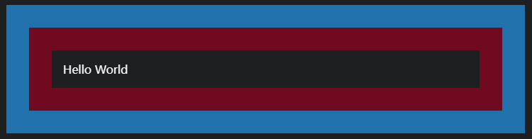

# [`box-shadow`](/)

* 当设置多个阴影渲染属性是倒序, 故前面的阴影会在后者之上

```css
/* x 偏移量 | y 偏移量 | 阴影颜色 */
box-shadow: 60px -16px teal;

/* x 偏移量 | y 偏移量 | 阴影模糊半径 | 阴影颜色 */
box-shadow: 10px 5px 5px black;

/* x 偏移量 | y 偏移量 | 阴影模糊半径 | 阴影扩散半径 | 阴影颜色 */
box-shadow: 2px 2px 2px 1px rgba(0, 0, 0, 0.2);

/* 插页 (阴影向内) | x 偏移量 | y 偏移量 | 阴影颜色 */
box-shadow: inset 5em 1em gold;

/* 任意数量的阴影，以逗号分隔 */
box-shadow:
  3px 3px red,
  -1em 0 0.4em olive;

/* 全局关键字 */
box-shadow: inherit;
box-shadow: initial;
box-shadow: unset;
```

* inset:
  * 如果没有指定inset，默认阴影在边框外，即阴影向外扩散。 使用 inset 关键字会使得阴影落在盒子内部，这样看起来就像是内容被压低了。此时阴影会在边框之内 (即使是透明边框）、背景之上、内容之下

## 术语

* box-shadow-color: 阴影颜色
* box-shadow-offset: 偏移量
* box-shadow-blur: 阴影模糊半径
* box-shadow-spread: 阴影扩散半径

## 偏移量和 blur 为零

```html
<div><p>Hello World</p></div>
```

```css
p {
  box-shadow:
    0 0 0 2em #f4aab9,
    0 0 0 4em #66ccff;
  margin: 4em;
  padding: 1em;
}

```


