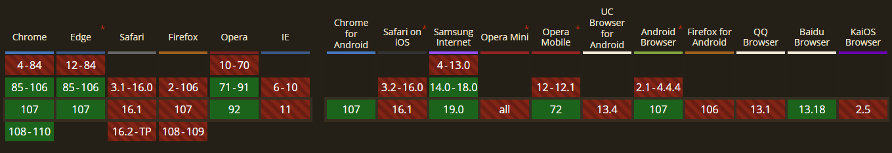
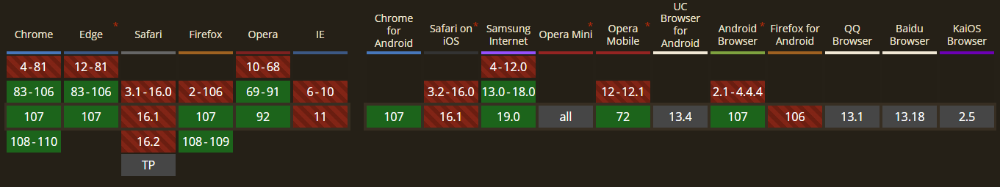

# content-visibility

属性值

> `content-visibility`是CSS新增的属性，
> 主要用来提高页面渲染性能，它可以控制一个元素是否渲染其内容，并且允许浏览器跳过这些元素的布局与渲染。

- visible：默认值，没有效果。元素的内容被正常布局和呈现
- hidden：元素跳过它的内容。跳过的内容不能被用户代理功能访问，例如在页面中查找、标签顺序导航等，也不能被选择或聚焦。这类似于给内容设置`display: none`
- auto：该元素打开布局包含、样式包含和绘制包含。如果该元素与用户不相关，它也会跳过其内容。与 hidden 不同，跳过的内容必须仍可正常用于用户代理功能，例如在页面中查找、tab 顺序导航等，并且必须正常可聚焦和可选择, 只有在可视区域才会被渲染

## `content-visibility: hidden`手动管理可见性

与display: none区别：

- `content-visibility: hidden` 只是隐藏了子元素，自身不会被隐藏
- `content-visibility: hidden` 隐藏内容的渲染状态会被缓存，所以当它被移除或者设为可见时，浏览器不会重新渲染，而是会应用缓存，所以对于需要频繁切换显示隐藏的元素，这个属性能够极大地提高渲染性能

## `content-visibility: auto`

> 只有在可视区域才会被渲染

### 问题

> 渲染元素前, 当前元素的高度为0, 滚动时候就会出现混乱
> 结合`contain-intrinsic-size` 来解决

## `contain-intrinsic-size`

> 指定元素的自然大小, 确保没有被渲染元素占据控件, 同事也保留延迟渲染的好处

是以下css的简写

- `contain-intrinsic-width`
- `contain-intrinsic-height`

```css
/* Keyword values */
contain-intrinsic-width: none;

/* <length> values */
contain-intrinsic-size: 1000px;
contain-intrinsic-size: 10rem;

/* width | height */
contain-intrinsic-size: 1000px 1.5em;

/* auto <length> */
contain-intrinsic-size: auto 300px;

/* auto width | auto height */
contain-intrinsic-size: auto 300px auto 4rem;
```

## 实现

```css
.card_item {
  content-visibility: auto;
  contain-intrinsic-size: 200px;
}
```

## 兼容性

> `content-visibility`



> `contain-intrinsic-size`


