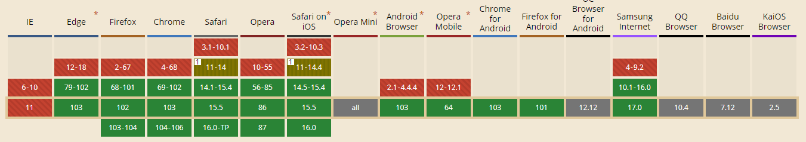

# `scroll-padding-top`

- 用来定义滚动窗口的最佳查看区域对于顶部的偏移量

```html
<header>
  <div>
  <h1>Some website</h1>
  <nav>
  <ul>
    <li>
      <a href="#section-first">Section 1</a>
    </li>
        <li>
      <a href="#section-second">Section 2</a>
    </li>
            <li>
      <a href="#section-third">Section 3</a>
    </li>
            <li>
      <a href="#section-fourth">Section 4</a>
    </li>
  </ul>
  </nav>
  </div>
</header>

<main>
  <section id="section-first">
    <h2>Lorem ipsum title 1</h2>
    <article>
      Lorem ipsum dolor sit amet, consectetur adipiscing elit. Suspendisse ullamcorper, massa eu rhoncus porttitor, enim dui scelerisque augue, sed eleifend quam dolor rhoncus dolor. Nunc sit amet ornare mi, eu vestibulum lectus. Mauris ac ultricies felis. Praesent ut orci vestibulum, tincidunt purus in, malesuada elit. Phasellus tempor dolor at accumsan suscipit. Maecenas efficitur hendrerit enim id pellentesque. Nunc placerat nibh sit amet malesuada vestibulum. Ut scelerisque sit amet velit in mattis. Mauris erat augue, eleifend nec posuere nec, vehicula vitae nibh. In hac habitasse platea dictumst.
    </article>
    
  </section>
    <section id="section-second">
    <h2>Lorem ipsum title 2</h2>
    <article>
      Lorem ipsum dolor sit amet, consectetur adipiscing elit. Suspendisse ullamcorper, massa eu rhoncus porttitor, enim dui scelerisque augue, sed eleifend quam dolor rhoncus dolor. Nunc sit amet ornare mi, eu vestibulum lectus. Mauris ac ultricies felis. Praesent ut orci vestibulum, tincidunt purus in, malesuada elit. Phasellus tempor dolor at accumsan suscipit. Maecenas efficitur hendrerit enim id pellentesque. Nunc placerat nibh sit amet malesuada vestibulum. Ut scelerisque sit amet velit in mattis. Mauris erat augue, eleifend nec posuere nec, vehicula vitae nibh. In hac habitasse platea dictumst.
    </article>
    
  </section>
    <section id="section-third">
    <h2>Lorem ipsum title 3</h2>
    <article>
      Lorem ipsum dolor sit amet, consectetur adipiscing elit. Suspendisse ullamcorper, massa eu rhoncus porttitor, enim dui scelerisque augue, sed eleifend quam dolor rhoncus dolor. Nunc sit amet ornare mi, eu vestibulum lectus. Mauris ac ultricies felis. Praesent ut orci vestibulum, tincidunt purus in, malesuada elit. Phasellus tempor dolor at accumsan suscipit. Maecenas efficitur hendrerit enim id pellentesque. Nunc placerat nibh sit amet malesuada vestibulum. Ut scelerisque sit amet velit in mattis. Mauris erat augue, eleifend nec posuere nec, vehicula vitae nibh. In hac habitasse platea dictumst.
    </article>
    
  </section>
    <section id="section-fourth">
    <h2>Lorem ipsum title 4</h2>
    <article>
      Lorem ipsum dolor sit amet, consectetur adipiscing elit. Suspendisse ullamcorper, massa eu rhoncus porttitor, enim dui scelerisque augue, sed eleifend quam dolor rhoncus dolor. Nunc sit amet ornare mi, eu vestibulum lectus. Mauris ac ultricies felis. Praesent ut orci vestibulum, tincidunt purus in, malesuada elit. Phasellus tempor dolor at accumsan suscipit. Maecenas efficitur hendrerit enim id pellentesque. Nunc placerat nibh sit amet malesuada vestibulum. Ut scelerisque sit amet velit in mattis. Mauris erat augue, eleifend nec posuere nec, vehicula vitae nibh. In hac habitasse platea dictumst.
    </article>
    
  </section>
</main>

<footer>
  Footer
</footer>
```

```css
* {
  box-sizing: border-box;
}

html {
  scroll-padding-top: 6rem;
  scroll-behavior: smooth;
}

nav ul {
  list-style: none;
  display: flex;
  gap: 1em;
  margin: 0;
  padding: 0;
}

header {
  position: fixed;
  top: 0;
  left: 0;
  right: 0;
  background-color: #eeeeee;
}

header > div {
  display: flex;
  padding: 0 2rem;
  justify-content: space-between;
  align-items: baseline;
  max-width: 768px;
  margin: 0 auto;
}

main {
  width: 768px;
  margin: 0 auto;
  padding-top: 6rem;
}

section {
  min-height: 50vh;
  background-color: #f9f9f9;
  padding: 1rem 2rem;
  margin-bottom: 1.5rem;
}

footer {
  min-height: 40vh;
  text-align: center;
}
```

<style>
 * {
  box-sizing: border-box;
}

html {
  scroll-padding-top: 6rem;
  scroll-behavior: smooth;
}

nav ul {
  list-style: none;
  display: flex;
  gap: 1em;
  margin: 0;
  padding: 0;
}

header {
  position: fixed;
  top: 0;
  left: 0;
  right: 0;
  background-color: #eeeeee;
}

header > div {
  display: flex;
  padding: 0 2rem;
  justify-content: space-between;
  align-items: baseline;
  max-width: 768px;
  margin: 0 auto;
}

main {
  width: 768px;
  margin: 0 auto;
  padding-top: 6rem;
}

section {
  min-height: 50vh;
  background-color: #f9f9f9;
  padding: 1rem 2rem;
  margin-bottom: 1.5rem;
}

footer {
  min-height: 40vh;
  text-align: center;
}
</style>

## 兼容性


