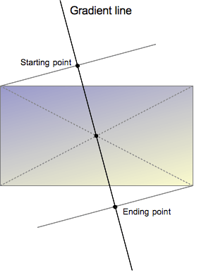

# [linear-gradient](https://developer.mozilla.org/zh-CN/docs/Web/CSS/gradient/linear-gradient)

> 用于创建一个表示两种或多种颜色线性渐变的图片。其结果属于`<gradient>`数据类型，是一种特别的`<image>`数据类型

## 线性渐变

> 线性渐变由一个轴 (梯度线) 定义，其上的每个点具有两种或多种的颜色，且轴上的每个点都具有独立的颜色。为了构建出平滑的渐变，`linear-gradient()` 函数构建一系列垂直于渐变线的着色线，每一条着色线的颜色则取决于与之垂直相交的渐变线上的色点



- 渐变线由包含渐变图形的容器的中心点和一个角度来定义的。渐变线上的颜色值是由不同的点来定义，包括起始点，终点，以及两者之间的可选的中间点（中间点可以有多个）

- 起始点是渐变线上代表起始颜色值的点。起始点由渐变线和过容器顶点的垂直线之间的交叉点来定义。（垂直线跟渐变线在同一象限内）

- 同样的，终点是渐变线上代表最终颜色值的点。终点也是由渐变线和从最近的顶点发出的垂直线之间的交叉点定义的，然而从起始点的对称点来定义终点是更容易理解的一种方式，因为终点是起点关于容器的中心点的反射点

- 关于起点和终点的稍微有些复杂的定义导致了一个有趣的性质，有时候被叫做不可思议的顶点效应：起点附近的点具有跟起点相同的颜色值，终点附近的点具有跟终点相同的颜色值

- 不仅仅只有起点和终点的颜色值可以指定。通过提供额外的颜色中间点，Web 开发者可以构建在起始颜色值和终点颜色值之间的自定义更强的过渡效果，另外还可以提供多种颜色值的渐变线

- 当颜色中间点的位置被隐式定义，它被放置在位于它之前的点和位于它之后的点之间的中间位置处。利用`<length>`或者`<percentage>`数据类型可以显示定义一个位置

```css
linear-gradient(red, orange, yellow, green, blue);
linear-gradient(red 0%, orange 25%, yellow 50%, green 75%, blue 100%);
```

<div style="width:100px; height: 100px; background: linear-gradient(red, orange, yellow, green, blue);" ></div>

<div style="width:100px; height: 100px; background: linear-gradient(red 0%, orange 25%, yellow 50%, green 75%, blue 100%);" ></div>
