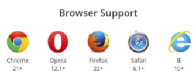

# flex

## 弹性布局

> - 弹性布局可以简便、完整、响应的实现各种页面上的布局。
>
> - 与静态不同的是，使用em或rem单位（lem=16px，1rem=10px）进行相对布局，相对使用百分比更加方便、灵活，相应同时支持浏览器的字体大小调整和缩放的等正常显示。
>
> - 优点：
>
>   1. 适应性强，在做多种不同的屏幕分辨率不同的界面是非常使用。
>   2. 随意按照宽度、比例划分元素的宽高。
>   3. 可以轻松的改变元素的显示顺序。
>   4. 网页布局实现快捷，维护起来更加容易。
>
> - 如果做移动端时，如果客户对细微的之处的要求不高，使用弹性布局进行制作是最好的选择，一份css+一份js调节font-size搞定。
>
> - 缺点： 浏览器兼容性较差，只能<u>兼容到IE9及以上</u>。
>
> - 使用:
>
>   ```css
>   .box{
>    display: flex; 
>     display: inline-flex; // 行内块
>     // Webkit 内核的浏览器
>     display: -webkit-flex; /* Safari */
>    display: flex;
>   }
>   ```
>
> - 设为 Flex 布局以后，子元素的`float`、`clear`和`vertical-align`属性将失效。



## 概念

> 容器默认存在两根轴：
>
> - 水平的主轴（main axis）和垂直的交叉轴（cross axis）。
>
> - 主轴的开始位置（与边框的交叉点）叫做`main start`，结束位置叫做`main end`；
>
> - 交叉轴的开始位置叫做`cross start`，结束位置叫做`cross end`。
>
> 项目默认沿主轴排列。单个项目占据的主轴空间叫做`main size`，占据的交叉轴空间叫做`cross size`。


## 容器的属性

> - `flex-direction :  row | row-reverse | column | column-reverse;`  => 决定主轴的方向(项目的排列方式)
> - `flex-wrap : nowrap | wrap | wrap-reverse;` => 如果一条轴线排不下，如何换行
> - `flex-flow :  <flex-direction> || <flex-wrap>;` => 是前flex-direction和flex-warp的简写方式
> - `justify-content : flex-start | flex-end | center | space-between | space-around;` => 项目在主轴上的对齐方式
> - `align-items : flex-start | flex-end | center | baseline | stretch;` => 项目在交叉轴上如何对齐
> - `align-content : flex-start | flex-end | center | space-between | space-around | stretch;` => 定义了多根轴线的对齐方式。如果项目只有一根轴线，该属性不起作用

### flex-direction

`flex-direction`属性决定主轴的方向（即项目的排列方向）。

> ```css
> .box {
>  flex-direction: row | row-reverse | column | column-reverse;
> }
> ```
>


它可能有4个值。

> - `row`（默认值）：主轴为水平方向，起点在左端。
> - `row-reverse`：主轴为水平方向，起点在右端。
> - `column`：主轴为垂直方向，起点在上沿。
> - `column-reverse`：主轴为垂直方向，起点在下沿。

### flex-wrap

默认情况下，项目都排在一条线（又称"轴线"）上。`flex-wrap`属性定义，如果一条轴线排不下，如何换行。

> ```css
> .box{
>  flex-wrap: nowrap | wrap | wrap-reverse;
> }
> ```

它可能取三个值。

（1）`nowrap`（默认）：不换行。


（2）`wrap`：换行，第一行在上方。


（3）`wrap-reverse`：换行，第一行在下方。


### flex-flow

`flex-flow`属性是`flex-direction`属性和`flex-wrap`属性的简写形式，默认值为`row nowrap`。

> ```css
> .box {
>   flex-flow: <flex-direction> || <flex-wrap>;
> }
> ```

### justify-content

`justify-content`属性定义了项目在主轴上的对齐方式。

> ```css
> .box {
>  justify-content: flex-start | flex-end | center | space-between | space-around;
> }
> ```


它可能取5个值，具体对齐方式与轴的方向有关。下面假设主轴为从左到右。

> - `flex-start`（默认值）：左对齐
> - `flex-end`：右对齐
> - `center`： 居中
> - `space-between`：两端对齐，项目之间的间隔都相等。
> - `space-around`：每个项目两侧的间隔相等。所以，项目之间的间隔比项目与边框的间隔大一倍。

### align-items

`align-items`属性定义项目在交叉轴上如何对齐。

> ```css
> .box {
>  align-items: flex-start | flex-end | center | baseline | stretch;
> }
> ```


它可能取5个值。具体的对齐方式与交叉轴的方向有关，下面假设交叉轴从上到下。

> - `flex-start`：交叉轴的起点对齐。
> - `flex-end`：交叉轴的终点对齐。
> - `center`：交叉轴的中点对齐。
> - `baseline`: 项目的第一行文字的基线对齐。
> - `stretch`（默认值）：如果项目未设置高度或设为auto，将占满整个容器的高度。

### align-content

`align-content`属性定义了多根轴线的对齐方式。如果项目只有一根轴线，该属性不起作用。

> ```css
> .box {
>  align-content: flex-start | flex-end | center | space-between | space-around | stretch;
> }
> ```


该属性可能取6个值。

> - `flex-start`：与交叉轴的起点对齐。
> - `flex-end`：与交叉轴的终点对齐。
> - `center`：与交叉轴的中点对齐。
> - `space-between`：与交叉轴两端对齐，轴线之间的间隔平均分布。
> - `space-around`：每根轴线两侧的间隔都相等。所以，轴线之间的间隔比轴线与边框的间隔大一倍。
> - `stretch`（默认值）：轴线占满整个交叉轴。

## 项目的属性

> - `order : <integer>`  => 项目的排列顺序。数值越小，排列越靠前，默认为0
> - `flex-grow: <number>` => 项目的放大比例，默认为`0`，即如果存在剩余空间，也不放大
> - `flex-shrink: <number>`=>  定义了项目的缩小比例，默认为1，即如果空间不足，该项目将缩小。
> - `flex-basis: <length> | auto; /* default auto */` => 定义了在分配多余空间之前，项目占据的主轴空间（main size）
> - `flex: none | [ <'flex-grow'> <'flex-shrink'>? || <'flex-basis'> ]`=> 默认值为`0 1 auto`
> - `align-self : auto | flex-start | flex-end | center | baseline | stretch;` => 允许单个项目有与其他项目不一样的对齐方式，可覆盖`align-items`属性。默认值为`auto`，表示继承父元素的`align-items`属性，如果没有父元素，则等同于`stretch`。

### order

> 定义项目的排列顺序。数值越小，排列越靠前，默认为0。

```css
.item {
 order: <integer>;
}
```


### flex-grow

> 定义项目的放大比例，默认为`0`，即如果存在剩余空间，也不放大。

```css
.item {
 flex-grow: <number>; /* default 0 */
}
```


### flex-shrink

> 定义了项目的缩小比例，默认为1，即如果空间不足，该项目将缩小。

```css
.item {
 flex-shrink: <number>; /* default 1 */
}
```


- 如果所有项目的`flex-shrink`属性都为1，当空间不足时，都将等比例缩小。

- 如果一个项目的`flex-shrink`属性为0，其他项目都为1，则空间不足时，前者不缩小。

- 负值对该属性无效。

### flex-basis

> 属性定义了在分配多余空间之前，项目占据的主轴空间（main size）。浏览器根据这个属性，计算主轴是否有多余空间。它的默认值为`auto`，即项目的本来大小。

```css
.item {
 flex-basis: <length> | auto; /* default auto */
}
```

它可以设为跟`width`或`height`属性一样的值（比如350px），则项目将占据固定空间。

### flex

> 属性是`flex-grow`, `flex-shrink` 和 `flex-basis`的简写，默认值为`0 1 auto`。后两个属性可选。

```css
.item {
 flex: none | [ <'flex-grow'> <'flex-shrink'>? || <'flex-basis'> ]
}
```

> 该属性有两个快捷值：`auto` (`1 1 auto`) 和 none (`0 0 auto`)。
>
> 建议优先使用这个属性，而不是单独写三个分离的属性，因为浏览器会推算相关值
> `flex: 2 200px` => 先给当前项留200px, 再根据前面属性进行均分

### align-self

> 属性允许单个项目有与其他项目不一样的对齐方式，可覆盖align-items属性。默认值为auto，表示继承父元素的align-items属性，如果没有父元素，则等同于stretch。

```css
.item {
 align-self: auto | flex-start | flex-end | center | baseline | stretch;
}
```


属性可能取6个值，除了auto，其他都与align-items属性完全一致。
