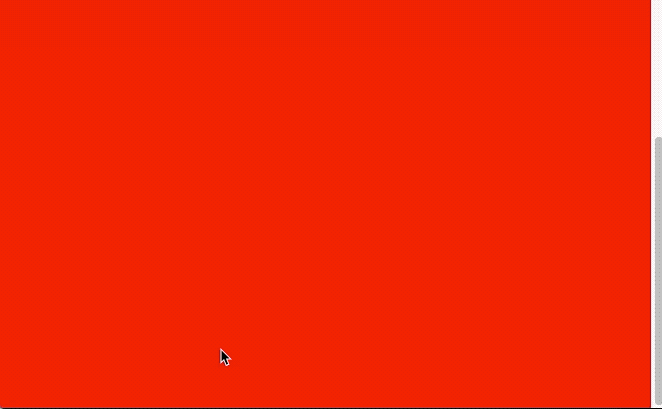

# [`fixed失效`]()

> <https://drafts.fxtf.org/filter-effects/#FilterProperty>

## 与 filter 使用

> 当在 body 中使用了 filter 滤镜属性的时候，会导致 fixed 元素定位发生错误，即不再相对 viewport 进行定位，而是相对整个网页（ body 元素）进行定位

```html
<html>
  <head>
    <title>css filter issue</title>
    <style>
      body {
        height: 600px;
        background: red;
        filter: grayscale(1);
      }
      .fixed {
        color: yellow;
        position: fixed;
        top: 0;
        right: 0;
      }
    </style>
  </head>
  <body>
    <div class="fixed">fixed item</div>
  </body>
</html>
```



### 解决方案

> 产生这个问题的原因就是：当 filter 不为 none 的时候，如果该元素或者其子元素具有 absolute 或 fixed 属性，那么它会为其创建一个新的包含块/容器，会造成该 absolute 或 fixed 元素的定位发生变化（就是改变了 absolute 或 fixed 元素的定位<父>元素，变成新创建的元素）。

> 以上面的例子说明，当在 body 标签中使用了 filter 属性后， filter 就会生成一个新的包含块，其位置大小和 body 一样，然后 fixed 元素就会根据这个包含块进行定位，所以我们会看到 fixed 元素失去原有的特性；

> 但是，如果 filter 作用在根元素（即 html 标签）时，它是不会为 absolute 或 fixed 子元素创建新的包含块的
> 所以解决方案也就很简单了，只需要将 filter 属性放在 html 标签上就好了

```css
html {
  filter: grayscale(1);
}
```

> `position: fixed`
>
> 当一个元素包含 fixed 属性时，屏幕视口（ viewport ）会为其创建一个包含块（ containing block ），其大小就是 viewport 的大小，然后该 fixed 元素基于该包含块进行定位。所以通常我们会说 fixed 元素是相对 viewport 来定位的。
>
> 此外， fixed 属性会创建新的层叠上下文。当元素祖先的 transform , perspective 或 filter 属性非 none 时，容器由视口改为该祖先。
