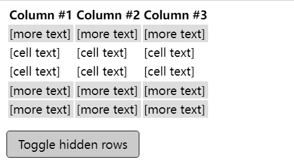

# 伪类(元素)

> Resudo-classes & Pseudo-elements

## 相关补充

```css
/* CSS3 语法 */
element::before { 样式 }

/* （单冒号）CSS2 过时语法 (仅用来支持 IE8) */
element:before  { 样式 }
```

## before & after
>
> - `before`:
> - `after`

```html
<q>一些引用</q>, 他说, <q>比没有好。</q>.
```

```css
q::before {
  content: "«";
  color: blue;
}
q::after {
  content: "»";
  color: red;
}
```


## selection

> 修改选中文本的样式

```html
This text has special styles when you highlight it.
<p>Also try selecting text in this paragraph.</p>
```

```css
::-moz-selection {
  color: gold;
  background-color: red;
}

p::-moz-selection {
  color: white;
  background-color: blue;
}
/* 选中的文本是红色背景，金黄色的字体 */
::selection {
  color: gold;
  background-color: red;
}

/*选中的是蓝色背景，白色的字体的段落*/
p::selection {
  color: white;
  background-color: blue;
}
```


## nth*

> `nth-child(an+b) & nth-of-type(an+b) & nth-last-child(an+b) & nth-last-of-type(an+b)`
>
> CSS 伪类首先找到所有当前元素的兄弟元素，然后按照位置先后顺序从1开始排序，选择的结果为CSS伪类:nth-child括号中表达式（an+b）匹配到的元素集合（n=0，1，2，3...）。示例：
>
> - 0n+3 或简单的 3 匹配第三个元素。
> - 1n+0 或简单的 n 匹配每个元素。（兼容性提醒：在 Android 浏览器 4.3 以下的版本 n 和 1n 的匹配方式不一致。1n 和 1n+0 是一致的，可根据喜好任选其一来使用。）
> - 2n+0 或简单的 2n 匹配位置为 2、4、6、8...的元素（n=0时，2n+0=0，第0个元素不存在，因为是从1开始排序)。你可以使用关键字 even 来替换此表达式。
> - 2n+1 匹配位置为 1、3、5、7...的元素。你可以使用关键字 odd 来替换此表达式。
> - 3n+4 匹配位置为 4、7、10、13...的元素。
> a 和 b 都必须为整数，并且元素的第一个子元素的下标为 1。换言之就是，该伪类匹配所有下标在集合 { an + b; n = 0, 1, 2, ...} 中的子元素。另外需要特别注意的是，an 必须写在 b 的前面，不能写成 b+an 的形式。
>
> `nth-of-type`: 忽略掉不符合选择器要求的元素
> `nth-last-child(an+b)`: 从后往前匹配
> `nth-last-of-type(an+b)`:  忽略掉不符合选择器要求的元素,从后往前匹配

```html
<h3><code>span:nth-child(2n+1)</code>, WITHOUT an
   <code>&lt;em&gt;</code> among the child elements.</h3>
<p>Children 1, 3, 5, and 7 are selected.</p>
<div class="first">
  <span>Span 1!</span>
  <span>Span 2</span>
  <span>Span 3!</span>
  <span>Span 4</span>
  <span>Span 5!</span>
  <span>Span 6</span>
  <span>Span 7!</span>
</div>

<br>

<h3><code>span:nth-child(2n+1)</code>, WITH an
   <code>&lt;em&gt;</code> among the child elements.</h3>
<p>Children 1, 5, and 7 are selected.<br>
   3 is used in the counting because it is a child, but it isn't
   selected because it isn't a <code>&lt;span&gt;</code>.</p>
<div class="second">
  <span>Span!</span>
  <span>Span</span>
  <em>This is an `em`.</em>
  <span>Span</span>
  <span>Span!</span>
  <span>Span</span>
  <span>Span!</span>
  <span>Span</span>
</div>

<br>

<h3><code>span:nth-of-type(2n+1)</code>, WITH an
   <code>&lt;em&gt;</code> among the child elements.</h3>
<p>Children 1, 4, 6, and 8 are selected.<br>
   3 isn't used in the counting or selected because it is an <code>&lt;em&gt;</code>,
   not a <code>&lt;span&gt;</code>, and <code>nth-of-type</code> only selects
   children of that type. The <code>&lt;em&gt;</code> is completely skipped
   over and ignored.</p>
<div class="third">
  <span>Span!</span>
  <span>Span</span>
  <em>This is an `em`.</em>
  <span>Span!</span>
  <span>Span</span>
  <span>Span!</span>
  <span>Span</span>
  <span>Span!</span>
</div>

```

```css
html {
  font-family: sans-serif;
}

span,
div em {
  padding: 5px;
  border: 1px solid green;
  display: inline-block;
  margin-bottom: 3px;
}

.first span:nth-child(2n+1),
.second span:nth-child(2n+1),
.third span:nth-of-type(2n+1) {
  background-color: lime;
}
```


## only*

### only-child

> - `only-child` *匹配没有任何兄弟元素的元素.*
> - 等效的选择器还可以写成 `:first-child:last-child`或者`:nth-child(1):nth-last-child(1)`,当然,前者的权重会低一点.
> - `only-of-type` 代表了任意一个元素，这个元素没有其他相同类型的兄弟元素。

```html
<main>
  <div>
    <i>I am a lonely only child.</i>
  </div>

  <div>
    <i>I have siblings.</i><br>
    <b>So do I!</b><br>
    <span>I also have siblings, <span>but this is an only child.</span></span>
  </div>
</main>
```

```css
main :only-child {
  color: red;
}

```


### only-of-type

```html
<main>
  <div>I am `div` #1.</div>
  <p>I am the only `p` among my siblings.</p>
  <div>I am `div` #2.</div>
  <div>I am `div` #3.
    <i>I am the only `i` child.</i>
    <em>I am `em` #1.</em>
    <em>I am `em` #2.</em>
  </div>
</main>
```

```css
main :only-of-type {
  color: red;
}
```


## first*

### first-child

> 一组兄弟元素中的第一个元素
> 不能改变所有的css属性. 你只能改变 margins、 orphans、 widows、文档什么时候换页。别的所有css样式都会被忽略。

```html
<div>
  <p>This text is selected!</p>
  <p>This text isn't selected.</p>
</div>

<div>
  <h2>This text isn't selected: it's not a `p`.</h2>
  <p>This text isn't selected.</p>
</div>
```

```css
p:first-child {
  color: lime;
  background-color: black;
  padding: 5px;
}
```


### first-of-type

> 一组兄弟元素中其类型的第一个元素

```html
<h2>Heading</h2>
<p>Paragraph 1</p>
<p>Paragraph 1</p>
```

```css
p:first-of-type {
  color: red;
  font-style: italic;
}
```


### first-letter

> - 伪元素
> - 选中某 block-level element（块级元素）第一行的第一个字母，并且文字所处的行之前没有其他内容（如图片和内联的表格）
> 只在display属性值为`block, inline-block, table-cell, list-item` 或者 `table-caption`的元素上才起作用
> 只有一小部分CSS可以在包含使用了::first-letter 伪元素选择器的CSS规则集声明块内运用:
>
> - 所有的字体属性 : ``font, font-style, font-feature-settings, font-kerning, font-language-override, font-stretch, font-synthesis, font-variant, font-variant-alternates, font-variant-caps, font-variant-east-asian , font-variant-ligatures, font-variant-numeric, font-variant-position, font-weight, font-size, font-size-adjust, line-height 以及 font-family.``
> - 所有的背景属性 : ``background-color, background-image, background-clip, background-origin, background-position, background-repeat, background-size, background-attachment以及 background-blend-mode.``
> - 所有的外边距属性: ``margin, margin-top, margin-right, margin-bottom, margin-left.``
> - 所有的内边距属性: ``padding, padding-top, padding-right, padding-bottom, padding-left.``
> - 所有的边框属性: 比如一些简短的边框属性 ``border, border-style, border-color, border-width, border-radius, border-image``, 还剩下许多冗长的边框属性等等.
> - ``color`` 属性.
> - ``text-decoration, text-shadow, text-transform, letter-spacing, word-spacing (使用恰当的话), line-height, text-decoration-color, text-decoration-line, text-decoration-style, box-shadow, float, vertical-align`` 注意此刻必须没有浮动) 等属性.

```html
<div class="fl">ruihuig</div>
<div class="fl">Ruihuig</div>
```

```css
.fl::first-letter{
 color: red;
}
```

### first-line

> - 伪元素
> - 块级元素 的第一行应用样式。第一行的长度取决于很多因素，包括元素宽度，文档宽度和文本的文字大小。
> - 和其他所有的 伪元素一样，::first-line 不能匹配任何真实存在的html元素。
> - ::first-line 伪元素只能在块容器中,所以,::first-line伪元素只能在一个display值为block, inline-block, table-cell 或者 table-caption中有用.。在其他的类型中，::first-line 是不起作用的.
> - 允许属性
>   - 所有和字体有关的属性：`font, font-kerning, font-style, font-variant, font-variant-numeric, font-variant-position, font-variant-east-asian (en-US), font-variant-caps, font-variant-alternates, font-variant-ligatures, font-synthesis, font-feature-settings, font-language-override, font-weight, font-size, font-size-adjust, font-stretch, and font-family`
 color
>   - 所有和背景有关的属性： `background-color, background-clip, background-image, background-origin, background-position, background-repeat, background-size,  background-attachment, and background-blend-mode
 word-spacing, letter-spacing, text-decoration, text-transform, and line-height
 text-shadow, text-decoration, text-decoration-color, text-decoration-line, text-decoration-style, and vertical-align.`

```html
<p>Lorem ipsum dolor sit amet, consectetur adipisicing elit,
sed do eiusmod tempor incididunt ut labore.</p>
```

```css
p::first-line { text-transform: uppercase }
```


## last*

### last-child

> 代表父元素的最后一个子元素

```html
<ul>
  <li>此元素背景色不是lime</li>
  <li>我的也不是lime。</li>
  <li>我的才是lime！ :)</li>
</ul>
```

```css
li:last-child {
  background-color: lime;
}
```


### last-of-type

> 表示了在（它父元素的）子元素列表中，最后一个给定类型的元素。当代码类似Parent tagName:last-of-type的作用区域包含父元素的所有子元素中的最后一个选定元素，也包括子元素的最后一个子元素并以此类推。

```html
<p>
  <em>我没有颜色 :(</em><br>
  <strong>我没有颜色 :(</strong><br>
  <em>我有颜色 :D</em><br>
  <strong>我也没有颜色 :(</strong><br>
</p>

<p>
  <em>我没有颜色 :(</em><br>
  <span><em>我有颜色!</em></span><br>
  <strong>我没有颜色 :(</strong><br>
  <em>我有颜色 :D</em><br>
  <span>
    <em>我在子元素里，但没有颜色!</em><br>
    <span style="text-decoration:line-through;"> 我没有颜色 </span><br>
    <em>我却有颜色！</em><br>
  </span><br>
  <strong>我也没有颜色 :(</strong>
</p>
```

```css
p em:last-of-type {
  color: lime;
}

```


## slotted

> 选定那些被放在 HTML模板 中的元素

```css
/* Selects any element placed inside a slot */
::slotted(*) {
  font-weight: bold;
}

/* Selects any <span> placed inside a slot */
::slotted(span) {
  font-weight: bold;
}

```

## root

> 表示 <html> 元素，除了优先级更高之外，与 html 选择器相同

```css
/* 声明css变量 */
:root {
  --main-color: hotpink;
  --pane-padding: 5px 42px;
}
```

```html
<p id="firstParagraph">This paragraph should have a blue background and yellow text.</p>
<p id="secondParagraph">This paragraph should have a yellow background and blue text.</p>
<div id="container">
  <p id="thirdParagraph">This paragraph should have a green background and yellow text.</p>
</div>
```

```css
:root {
  --first-color: #16f;
  --second-color: #ff7;
}

#firstParagraph {
  background-color: var(--first-color);
  color: var(--second-color);
}

#secondParagraph {
  background-color: var(--second-color);
  color: var(--first-color);
}

#container {
  --first-color: #290;
}

#thirdParagraph {
  background-color: var(--first-color);
  color: var(--second-color);
}

```

```css
:root {
  --first-color: #16f;
  --second-color: #ff7;
}

#firstParagraph {
  background-color: var(--first-color);
  color: var(--second-color);
}

#secondParagraph {
  background-color: var(--second-color);
  color: var(--first-color);
}

#container {
  --first-color: #290;
}

#thirdParagraph {
  background-color: var(--first-color);
  color: var(--second-color);
}
```


## link & visited & hover & active
>
> - :active 伪类一般被用在 `<a>` 和 `<button>` 元素中. 这个伪类的一些其他适用对象包括包含激活元素的元素，以及可以通过他们关联的`<label>`标签被激活的表格元素。
>

```html
<p>This paragraph contains a link:
  <a href="#">This link will turn red while you click on it.</a>
  The paragraph will get a gray background while you click on it or the link.
</p>
```

```css
a:link { color: blue; }          /* 未访问链接 */
a:visited { color: purple; }     /* 已访问链接 */
a:hover { background: yellow; }  /* 用户鼠标悬停 */
a:active { color: red; }         /* 激活链接 */
p:active { background: #eee; }   /* 激活段落 */
```


## default

> 一组相关元素中的默认表单元素

```html
<input type="radio" name="season" id="spring">
<label for="spring">Spring</label>

<input type="radio" name="season" id="summer" checked>
<label for="summer">Summer</label>

<input type="radio" name="season" id="fall">
<label for="fall">Fall</label>

<input type="radio" name="season" id="winter">
<label for="winter">Winter</label>
```

```css

input:default {
  box-shadow: 0 0 2px 1px coral;
}

input:default + label {
  color: coral;
}
```


## defined

> 表示任何已定义的元素。这包括任何浏览器内置的标准元素以及已成功定义的自定义

```css
/* 选择所有已定义的元素 */
:defined {
  font-style: italic;
}

/* 选择指定自定义元素的任何实例 */
simple-custom:defined {
  display: block;
}

```

## checked

> 处于选中状态的radio(``<input type="radio">``), checkbox (``<input type="checkbox">``) 或("select") 元素中的option HTML元素("option")。

```css
/* 匹配任意被勾选/选中的radio(单选按钮),checkbox(复选框),或者option(select中的一项) */
:checked {
  margin-left: 25px;
  border: 1px solid blue;
} 
```

```html
<div>
  <input type="radio" name="my-input" id="yes">
  <label for="yes">Yes</label>

  <input type="radio" name="my-input" id="no">
  <label for="no">No</label>
</div>

<div>
  <input type="checkbox" name="my-checkbox" id="opt-in">
  <label for="opt-in">Check me!</label>
</div>

<select name="my-select" id="fruit">
  <option value="opt1">Apples</option>
  <option value="opt2">Grapes</option>
  <option value="opt3">Pears</option>
</select>

```

```css
div,
select {
  margin: 8px;
}

/* Labels for checked inputs */
input:checked + label {
  color: red;
}

/* Radio element, when checked */
input[type="radio"]:checked {
  box-shadow: 0 0 0 3px orange;
}

/* Checkbox element, when checked */
input[type="checkbox"]:checked {
  box-shadow: 0 0 0 3px hotpink;
}

/* Option elements, when selected */
option:checked {
  box-shadow: 0 0 0 3px lime;
  color: red;
}
```


### 借用隐藏的checkbox来切换元素的样式（显示/隐藏）

```html
<input type="checkbox" id="expand-toggle" />

<table>
  <thead>
    <tr><th>Column #1</th><th>Column #2</th><th>Column #3</th></tr>
  </thead>
  <tbody>
    <tr class="expandable"><td>[more text]</td><td>[more text]</td><td>[more text]</td></tr>
    <tr><td>[cell text]</td><td>[cell text]</td><td>[cell text]</td></tr>
    <tr><td>[cell text]</td><td>[cell text]</td><td>[cell text]</td></tr>
    <tr class="expandable"><td>[more text]</td><td>[more text]</td><td>[more text]</td></tr>
    <tr class="expandable"><td>[more text]</td><td>[more text]</td><td>[more text]</td></tr>
  </tbody>
</table>

<label for="expand-toggle" id="expand-btn">Toggle hidden rows</label>

```

```css
/* Hide the toggle checkbox */
#expand-toggle {
  display: none;
}

/* Hide expandable content by default */
.expandable {
  visibility: collapse;
  background: #ddd;
}

/* Style the button */
#expand-btn {
  display: inline-block;
  margin-top: 12px;
  padding: 5px 11px;
  background-color: #ff7;
  border: 1px solid;
  border-radius: 3px;
}

/* Show hidden content when the checkbox is checked */
#expand-toggle:checked ~ * .expandable {
  visibility: visible;
}

/* Style the button when the checkbox is checked */
#expand-toggle:checked ~ #expand-btn {
  background-color: #ccc;
}

```



## disabled

> 表示任何被禁用的元素
> 如果一个元素不能被激活（如选择、点击或接受文本输入）或获取焦点，则该元素处于被禁用状态。元素还有一个启用状态（enabled state），在启用状态下，元素可以被激活或获取焦点。

```css
/* Selects any disabled <input> */
input:disabled {
  background: #ccc;
}
```

## empty

> 代表没有子元素的元素。子元素只可以是元素节点或文本（包括空格）。注释或处理指令都不会产生影响。

```html
<div class="box"><!-- I will be lime --></div>
<div class="box">I will be pink</div>
<div class="box">
    <!-- I will be red because of the whitespace around this comment -->
</div>
```

```css
.box {
    background: pink;
    height: 80px;
    width: 80px;
}

.box:empty {
    background: lime;
}

```


## enabled

> 任何被启用的（enabled）元素。如果一个元素能够被激活（如选择、点击或接受文本输入），或者能够获取焦点，则该元素是启用的。元素也有一个禁用的状态（disabled state），在被禁用时，元素不能被激活或获取焦点

```html
<form action="url_of_form">
  <label for="FirstField">First field (enabled):</label>
  <input type="text" id="FirstField" value="Lorem"><br>

  <label for="SecondField">Second field (disabled):</label>
  <input type="text" id="SecondField" value="Ipsum" disabled="disabled"><br>

  <input type="button" value="Submit">
</form>
```

```css
input:enabled {
  color: #2b2;
}

input:disabled {
  color: #aaa;
}
```


## focus*

### focus

> 表示获得焦点的元素（如表单输入）。当用户点击或触摸元素或通过键盘的 “tab” 键选择它时会被触发。
> 此伪类仅适用于焦点元素本身。如果要选择包含焦点元素的元素，请使用`:focus-within`

```html
<input class="red-input" value="I'll be red when focused."><br>
<input class="blue-input" value="I'll be blue when focused.">
```

```css
.red-input:focus {
  background: yellow;
  color: red;
}

.blue-input:focus {
  background: yellow;
  color: blue;
}
```


### focus-within

> 表示一个元素获得焦点，或，该元素的后代元素获得焦点。换句话说，元素自身或者它的某个后代匹配 `:focus` 伪类

```html
<p>试试在这个表单中输入点什么。</p>

<form>
  <label for="given_name">Given Name:</label>
  <input id="given_name" type="text">
  <br>
  <label for="family_name">Family Name:</label>
  <input id="family_name" type="text">
</form>
```

```css
form {
  border: 1px solid;
  color: gray;
  padding: 4px;
}

form:focus-within {
  background: #ff8;
  color: black;
}

input {
  margin: 4px;
}

```


### focus-visible

> 当元素匹配:focus伪类并且客户端(UA)的启发式引擎决定焦点应当可见(在这种情况下很多浏览器默认显示“焦点框”。)时，:focus-visible 伪类将生效。
> 这个选择器可以有效地根据用户的输入方式(鼠标 vs 键盘)展示不同形式的焦点。
> 请注意Firefox通过较旧的前缀伪类 :-moz-focusring 支持类似的功能。更多细节请参考:-moz-focusring (en-US)页面。

```html
<input value="Default styles"><br>
<button>Default styles</button><br>
<input class="focus-only" value=":focus only"><br>
<button class="focus-only">:focus only</button><br>
<input class="focus-visible-only" value=":focus-visible only"><br>
<button class="focus-visible-only">:focus-visible only</button>
```

```css
input, button {
  margin: 10px;
}

.focus-only:focus {
  outline: 2px solid black;
}

.focus-visible-only:focus-visible {
  outline: 4px dashed darkorange;
}
```


> `focus-visible btn` 不会触发点击按钮的边框

## *range

### out-of-range

> CSS 伪类 表示一个 `<input>` 元素，其当前值处于属性 min 和 max 限定的范围外。

### in-range

> CSS 伪类 代表一个 `<input>` 元素，其当前值处于属性min 和max 限定的范围之内.

```html
<form action="" id="form1">
  <ul>Values between 1 and 10 are valid.
    <li>
      <input id="value1" name="value1" type="number" placeholder="1 to 10" min="1" max="10" value="12">
      <label for="value1">Your value is </label>
    </li>
  </ul>
</form>
```

```css
li {
  list-style: none;
  margin-bottom: 1em;
}

input {
  border: 1px solid black;
}

input:in-range {
  background-color: rgba(0, 255, 0, 0.25);
}

input:out-of-range {
  background-color: rgba(255, 0, 0, 0.25);
  border: 2px solid red;
}

input:in-range + label::after {
  content: 'okay.';
}

input:out-of-range + label::after {
  content: 'out of range!';
}
```


## autofill

> 浏览器自动填充是触发, 用户编辑就会停止匹配
> 注意：许多浏览器的用户代理样式表在其样式声明中使用，使它们无法被网页覆盖，而无需诉诸JavaScript黑客。例如，Chrome在其内部样式表中具有以下内容：!important:-webkit-autofill

```html
<form method="post" action="">
  <label for="email">Email</label> <input type="email" name="email" id="email" autocomplete="email">
</form>

```

```css
input {
  border: 3px solid grey;
  border-radius: 3px;
}

input:-webkit-autofill {
  border: 3px solid blue;
}
input:autofill {
  border: 3px solid blue;
}

```


## not

- 用来匹配不符合一组选择器的元素。由于它的作用是防止特定的元素被选中，它也被称为反选伪类（negation pseudo-class）。

- :not() 伪类不能被嵌套，这意味着 :not(:not(...)) 是无效的。
- 由于伪元素不是简单的选择器，他们不能被当作 :not() 中的参数，形如 :not(p::before) 这样的选择器将不会工作。
- 可以利用这个伪类写一个完全没有用处的选择器。例如， :not(*) 匹配任何非元素的元素，因此，这个规则将永远不会被应用。
- 可以利用这个伪类提高规则的优先级。例如， #foo:not(#bar) 和 #foo 会匹配相同的元素，但是前者的优先级更高。
- :not(.foo) 将匹配任何非 .foo 的元素，包括 `<html>` 和 `<body>`。
- 这个选择器只会应用在一个元素上，无法用它来排除所有父元素。比如， body :not(table) a 依旧会应用到表格元素 `<table>` 内部的 `<a>` 上, 因为`<tr>`将会被 `:not(table)` 这部分选择器匹配。

```html
<p>我是一个段落。</p>
<p class="fancy">我好看极了！</p>
<div>我「不是」一个段落。</div>
```

```css
.fancy {
  text-shadow: 2px 2px 3px gold;
}

/* 类名不是 `.fancy` 的 <p> 元素 */
p:not(.fancy) {
  color: green;
}

/* 非 <p> 元素 */
body :not(p) {
  text-decoration: underline;
}

/* 既不是 <div> 也不是 <span> 的元素 */
body :not(div):not(span) {
  font-weight: bold;
}

/* 类名不是 `.crazy` 或 `.fancy` 的元素 */
/* 注意，此语法尚未获广泛支持。 */
body :not(.crazy, .fancy) {
  font-family: sans-serif;
}
```


## target

> 代表一个唯一的页面元素(目标元素)，其id 与当前URL片段匹配
> 经常与`<a>`连用

```html
<h3>Table of Contents</h3>
<ol>
 <li><a href="#p1">Jump to the first paragraph!</a></li>
 <li><a href="#p2">Jump to the second paragraph!</a></li>
 <li><a href="#nowhere">This link goes nowhere,
   because the target doesn't exist.</a></li>
</ol>

<h3>My Fun Article</h3>
<p id="p1">You can target <i>this paragraph</i> using a
  URL fragment. Click on the link above to try out!</p>
<p id="p2">This is <i>another paragraph</i>, also accessible
  from the links above. Isn't that delightful?</p>

```

```css
p:target {
  background-color: gold;
}

/* 在目标元素中增加一个伪元素*/
p:target::before {
  font: 70% sans-serif;
  content: "►";
  color: limegreen;
  margin-right: .25em;
}

/*在目标元素中使用italic样式*/
p:target i {
  color: red;
}
```


点击`Jump to the first paragraph`


## scope

> 作为选择器要匹配的参考点的元素
>
> 不支持IE

- 当需要获取已检索到的的直接后代元素时，:scope 伪类很有用

```js
var context = document.getElementById('context');
var selected = context.querySelectorAll(':scope > div');

document.getElementById('results').innerHTML = Array.prototype.map.call(selected, function (element) {
    return '#' + element.getAttribute('id');
}).join(', ');
```

```html
<div id="context">
    <div id="element-1">
        <div id="element-1.1"></div>
        <div id="element-1.2"></div>
    </div>
    <div id="element-2">
        <div id="element-2.1"></div>
    </div>
</div>
<p>
    Selected elements ids :
    <span id="results"></span>
</p>
```


## read*

### read-only

> 元素不可被用户编辑的状态(锁文本输入)

```html
<input type="text" value="Type whatever you want here.">
<input type="text" value="This is a read-only field." readonly>
<p>This is a normal paragraph.</p>
<p contenteditable="true">You can edit this paragraph!</p>
```

```css
input { min-width: 25em; }
input:-moz-read-only { background: cyan; }
input:read-only { background: cyan; }

p:-moz-read-only { background: lightgray; }
p:read-only { background: lightgray; }
p[contenteditable="true"] { color: blue; }

```


### read-write

> 代表一个元素（例如可输入文本的 input元素）可以被用户编辑

```html
<input type="text" value="Type whatever you want here.">
<input type="text" value="This is a read-only field." readonly>
<p>This is a normal paragraph.</p>
<p contenteditable="true">You can edit this paragraph!</p>
```

```css
input { min-width: 25em; }
input:-moz-read-write { background: cyan; }
input:read-write { background: cyan; }

p:-moz-read-write { background: lightgray; }
p:read-write { background: lightgray; }
p[contenteditable="true"] { color: blue; }

```


## 表单元素相关

### required

> 表示任意设置了required属性的`<input>`，`<select>`, 或 `<textarea>`元素
> 这个伪类对于高亮显示在提交表单之前必须具有有效数据的字段非常有用。

### optional

> 表示任意`没有required`属性的 `<input>`，`<select>` 或  `<textarea>` 元素使用

### indeterminate

> 状态不确定的表单元素(例如checkbox没有初始化)

### *valid

#### valid

> 表示内容验证正确的`<input>` 或其他 `<form>` 元素。这能简单地将校验字段展示为一种能让用户辨别出其输入数据的正确性的样式。
> 选择正确校验通过的字段元素
> `>ie10`

#### invalid

> 表示任意内容未通过验证的 `<input>` 或其他 `<form>` 元素 .

```html
<form>
  <label for="url_input">Enter a URL:</label>
  <input type="url" id="url_input" />
  <br />
  <br />
  <label for="email_input">Enter an email address:</label>
  <input type="email" id="email_input" required/>
</form>
```

```css
input:invalid {
  background-color: #ffdddd;
}

form:invalid {
  border: 5px solid #ffdddd;
}

input:valid {
  background-color: #ddffdd;
}

form:valid {
  border: 5px solid #ddffdd;
}****

input:required {
  border-color: #800000;
  border-width: 3px;
}

input:required:invalid {
  border-color: #C00000;
}
```


## 打印相关

### right

> 必须与@规则  @page 一起配套使用，表示打印文档的所有右页。
> 只能用于更改页面的 margin, padding, border, and background 属性。其它属性都将被忽略，只会影响页框，不会影响文档内容。

### first

> @page CSS 伪类选择器 描述的是：打印文档的时候，第一页的样式。

```html

<p>First Page.</p>
<p>Second Page.</p>
<button>Print!</button>
```

```css
@page :first {
  margin-left: 50%;
  margin-top: 50%;
}
p {
  page-break-after: always;
}
```

```js
document.querySelector("button").onclick = function(){ window.print() }
```


