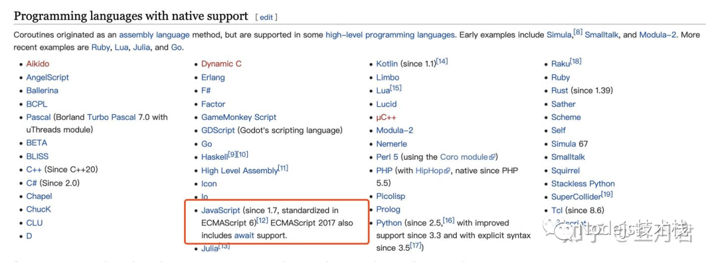

# JavaScript/Node.js 有协程

- 从 Callback 到 Promise 的 .then().then()... 也是在不断尝试去解决异步编程带来的回调嵌套、错误管理等问题，Promise 进一步解决了这些问题
- 当异步链多了之后你会发现代码会变成这样 .then().then()... 由原来的横向变成了纵向的模式，仍就存在冗余的代码，基于我们大脑对事物的思考
- 我们更倾向于一种近乎 “同步” 的写法来表达我们的异步代码，在 ES6 规范中为我们提供了 Generator 函数进一步改善我们的代码编写方式

## Generator

> Generator 中文翻译过来我们可以称呼它为 “生成器”，它拥有函数的执行权，知道什么时候暂停、什么时候执行，这里还有一个概念协程

## 进程

- 进程（Process）是计算机中的程序关于某数据集合上的一次运行活动，是系统进行资源分配和调度的基本单位，是操作系统结构的基础，进程是线程的容器（来自百科）。

- 启动一个服务、运行一个实例，就是开一个服务进程，例如 Java 里的 JVM 本身就是一个进程，Node.js 里通过 node app.js 开启一个服务进程，多进程就是进程的复制（fork），fork 出来的每个进程都拥有自己的独立空间地址、数据栈，一个进程无法访问另外一个进程里定义的变量、数据结构，只有建立了 IPC 通信，进程之间才可数据共享。

- Mac 系统自带的监控工具 “活动监视器” 也可看到效果。
  


- Node.js 中我们通过 Cluster 模块创建多进程时为什么要根据 CPU 核心数？创建更多不好吗？在一个 CPU 核心的任何时间内只能执行一个进程。因此，当你 CPU 核心数有限时，创建过多的进程，CPU 也是忙不过来的。

- Node.js 通过单线程 + 事件循环解决了并发问题。而我们使用 Node.js 利用 Cluster 模块根据 CPU 核心数创建多进程解决的是并行问题，假设我有 4 CPU 每个 CPU 分别对应一个线程并行处理 A、B、C、D 不同的任务，线程之间互不抢占资源。

- 一句话总结：进程之间数据完全隔离、由操作系统调度，自动切换上下文信息，属系统层级的构造。

## 线程

- 线程是操作系统能够进行运算调度的最小单位，首先我们要清楚线程是隶属于进程的，被包含于进程之中。一个线程只能隶属于一个进程，但是一个进程是可以拥有多个线程的。

- 同一块代码，可以根据系统 CPU 核心数启动多个进程，每个进程都有属于自己的独立运行空间，进程之间是不相互影响的。同一进程中的多条线程将共享该进程中的全部系统资源，如虚拟地址空间，文件描述符和信号处理等。但同一进程中的多个线程有各自的调用栈（call stack），自己的寄存器环境（register context），自己的线程本地存储（thread-local storage)，线程又有单线程和多线程之分，具有代表性的 JavaScript、Java 语言。

- 线程共享进程的资源，可以由系统调度运行，可以自动完成线程切换，也许你会听到多线程编程、并发问题，首先，并发指的某个时间点多个任务队列对应到同一个 CPU 上运行，在任一时间点内也只会有一个任务队列在 CPU 上执行，这时就产生排队了。

- 为了解决这个问题，CPU 运行时间片会被分成多个 CPU 时间段，每个时间段给各个任务队列执行（对应多个线程），这样解决了一个任务如果造成阻塞，不会影响到其它的任务运行，同样线程是会自动切换的。

- Node.js 是怎么解决的并发问题？Node.js 主线程是单线程的，核心通过事件循环，每次循环时取出任务队列中的可执行任务运行，没有多线程上下文切换，资源抢占问题，达到高并发成就。

- 一句话总结：线程之间大多数共享数据（各自的调用栈这些信息除外），由操作系统调用，自动切换上下文，系统层级的构造。

## 协程

- 协程又称为微线程、纤程，英文 Coroutine。协程类似于线程，但是协程是协作式多任务的，而线程是抢占式多任务的。协程之间的调用不需要涉及任何系统调用，是语言层级的构造，可看作一种形式的控制流，有时候我们也会称它为用户态的轻量级线程。

- 协程一个特点是通过关键字 yield 调用其它协程，接下来每次协程被调用时，从协程上次 yield 返回的位置接着执行，这种通过 yield 协作转移执行权的操作，彼此没有调用者和被调用者的关系，是彼此平等对称的一种关系。

- 协程与线程两者的差异，可以看出 “同一时间如果有多个线程，但它们会都处于运行状态，线程是抢占式的，而协程同一时间运行的只有一个，其它的协程处于暂停状态，执行权由协程自己分配”。

- 协程也不是万能的，它需要配合异步 I/O 才能发挥最好的效果，对于操作系统而言是不知道协程的存在的，它只知道线程。需要注意，如果一个协程遇到了阻塞的 I/O 调用，这时会导致操作系统让线程阻塞，那么在这个线程上的其它协程也都会陷入阻塞。

- 一句话总结：协程共享数据，由程序控制完成上下文切换，语言层级的构造。

## JavaScript 有协程吗

之前知乎上有个问题 “Node.js 真的有协程吗？” 协程在很多语言中都支持，只是每个实现略有差异，下图来自维基百科展示了支持协程的编程语言，可以看到 JavaScript 在 ECMAScript 6 支持，ECMAScript 7 之后通过 await 支持，Node.js 做为 JavaScript 在服务端的运行时，只要你的 Node.js 版本对应支持，就是可以的。


## 协程在 JavaScript 中的实现

### 生成器与协程

- 生成器（Generator）是协程的子集，也称为 “半协程”。差异在于，生成器只能把控制权交给它的调用者，完全协程有能力控制在它让位之后哪个协程立即接续它执行。在 JavaScript 里我们说的 Generator 函数就是 ES6 对协程的实现。

- JavaScript 是一个单线程的语言，只能保持一个调用栈。在异步操作的回调函数里，一旦出错原始的调用栈早已结束，引入协程之后每个任务可以保持自己的调用栈，这样解决的一大问题是出错误时可以找到原始的调用栈。

- 看下生成器函数与普通函数有什么区别？首先普通函数通过栈实现的，举个例子，调用时是 `A() -> B() -> C()` 入栈，最后是 `C() -> B() -> A()` 这样一个顺序最后进入的先出栈执行。

- 生成器函数看似和普通函数相似，其实内部执行机制是完全不同的，生成器函数在内部执行遇到 yield 会交出函数的执行权给其它协程（此处类似 CPU 中断），转而去执行别的任务，在将来一段时间后等到执行权返回（生成器还会把控制权交给它的调用者），程序再从暂停的地方继续执行。

### 无堆栈协程

- 自 ES6 开始，通过 `Generator` 和 `yield` 表达式提供了无堆栈协程功能

> “无栈协程的秘密在于它们只能从顶级函数中挂起自己。对于其他所有函数，它们的数据都分配在被调用者堆栈上，因此从协程调用的所有函数必须在挂起协程之前完成。协程保留其状态所需的所有数据都在堆上动态分配。这通常需要几个局部变量和参数，其大小远小于预先分配的整个堆栈”。参考 coroutines-introduction

栈是一块连续的内存，能够从子函数产生的协程称为栈式，它们可以记住整个调用栈，这种也称为栈式协程。在 JavaScript 中我们只能从生成器函数内部暂停、恢复执行生成器函数。

下面示例 test1() 是生成器函数，但是 forEach 里面的匿名函数是一个普通的函数，就无法在内部使用 yield 关键字，运行时会抛出错误 “SyntaxError: Unexpected identifier”

```js

function *test1() {
  console.log('execution start');
  
  ['A', 'B'].forEach(function(item) {
    yield item;
  })
}
```

### 生成器函数示例

例如，现在有两个生成器函数 test1()、test2()，还有 co 这个工具可以帮助我们自动的执行生成器函数。

```js
const co = require('co');
function *test1() {
  console.log('execution 1');
  console.log(yield Promise.resolve(1));
  console.log('execution 2');
  console.log(yield Promise.resolve(2));
}

function *test2() {
  console.log('execution a');
  console.log(yield Promise.resolve('a'));
  console.log('execution b');
  console.log(yield Promise.resolve('b'));
}

co(test1);
co(test2);
```

#### 看下运行结果

> 第一次程序执行 test1() 函数，先输出 'execution 1' 遇到 yield 语句程序的控制权转移。
现在执行权转移到了 test2() 函数，执行代码输出 'execution a' 当遇到 yield 语句后交出程序的控制权。
此时 test1() 函数收回执行权，恢复执行输出 '1' 继续往下执行输出 'execution 2' 当遇到 yield 语句再次交出执行权，依次类推。

```js
execution 1
execution a
1
execution 2
a
execution b
2
b
```

## 总结

“JavaScript 有协程吗？” JavaScript 中是在 ES6 后基于生成器函数（Generator）实现的，生成器只能把程序的执行权还给它的调用者，这种方式我们称为 “半协程”，而完全的协程是任何函数都可让暂停的协程执行。

基于生成器函数这种写法，如果去掉 yield 关键字，与我们普通的函数是相似的，以一种同步的方式来表达，解决了回调嵌套的问题，另外我们还可以通过 try...catch 做错误捕获，只不过我们还需要借助 CO 这样的模块，让生成器函数自动执行，这个问题在 ES7 中已经得到了更好地解决，可以通过 async/await 轻松的实现

Reference
<https://en.wikipedia.org/wiki/Coroutine#Implementations_in_JavaScript>
<https://zhuanlan.zhihu.com/p/70256971>
<http://zhangchen915.com/index.php/archives/719/>
<https://es6.ruanyifeng.com/#docs/generator>
