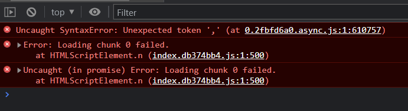
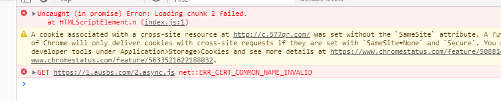

# dva 问题

## 项目打包后,要刷新才正常

- data: 2022-11-16 10:28:11

> 有问题浏览器:
>
> - Chrome(Version 109.0.5410.0 (Official Build) dev (64-bit))
> - Chrome(Version 107.0.5304.107 (Official Build) (64-bit))
> - edge(版本 107.0.1418.42 (正式版本) (64 位))
>
> 正常浏览器: 火狐
>
> - 强制清理缓存, 重复多次, 也有概率复现

## react+dva+antd打包运行，项目时常出现报错：Loading chunk n failed.——求解决

> 表现的形式:页面空白，控制栏报错如下：除非强制刷新页面才可以正常展示。不是每个页面都会出现，偶尔出现

