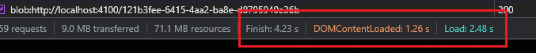
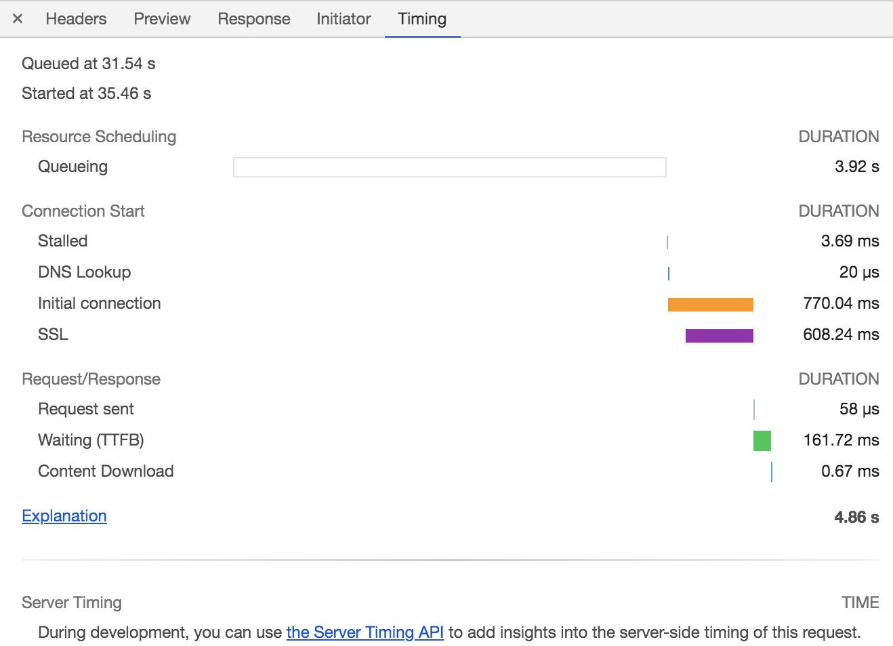
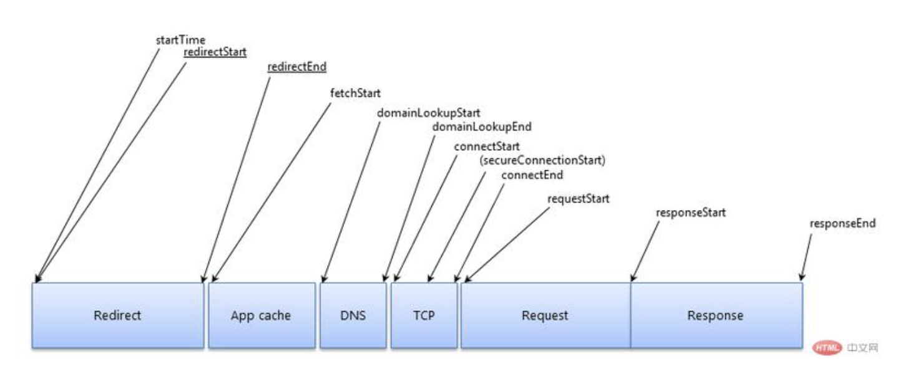

# chrome 分析页面加载时间

## 在Network面板查看

- finish：页面最后一个请求截止的时间，如果页面加载完成后，触发了ajax请求，那么该时间会变更。
- DOMContentLoaded：dom内容加载并解析完成的时间，即页面白屏时间
- load：页面所有的资源（图片、音频、视频等）加载完成的时间。

当页面的初始的标记被解析完成时，会触发DOMContentLoaded，它在Network面板上的两个位置显示：

- 在Overview窗格中的蓝色垂直线表示这个事件。
- 在Summary窗格中，可以查看这个事件的确切耗时。

当页面完全加载时触发load事件，它显示在三个地方：

- 在Overview窗格的红色垂直线表示这个事件。
- 在Request Table中的红色垂直线也表示这个事件。
- 在Summary中，可以查看该事件的确切时间。

## 查看网络时序

> 点击Timing选项卡可以查看单个资源的请求生命周期的明细分类。

- Queuing 队列
- Stalled 停滞
- DNS lookup DNS查找
- initial connection 初始连接
- SSL handshake SSL握手
- Request sent 请求发送
- Waiting 等待，具体指到开始下载第一个字节的时间（TTFB：time for first byte）
- Content Download 内容下载

## 资源加载时序

> 所有网络请求都被视为资源，当它们通过网络检索时，分为不同的生命周期。

一个完整请求生命周期的主要阶段如下

### Redirect 重定向

- 立即开始 startTime
- 如果发生重定向，redirectStart也会开始计时
- 如果重定向发生在此阶段结束，那么redirectEnd被采用

### App Cache 应用程序缓存

- 如果浏览器有缓存，将采用fetchStart时间

### DNS

- domainLookupStart 记录DNS请求开始时间
- domainLookupEnd记录DNS请求结束的时间

### TCP

- connectStart 记录开始连接到服务器的时间
- 如果用了TLS或者SSL，secureConnectionStart记录开始连接时间
- connectEnd记录连接完毕时间

### Request 请求

- requestStart记录请求发生到服务器的时间

### Response 响应

- responeseStart记录最开始的响应时间
- responseEnd记录响应结束时间

## timing面板信息详解

## Queuing 排队 如果一个请求排队，则表明

- 请求被渲染引擎推迟，因为它比关键资源（如脚本/样式）的优先级低。例如，images。
- 这个请求被搁置，在等待一个即将被释放的不可用的TCP socket
- 这个请求被搁置，因为浏览器限制。在HTTP 1协议中，每个源上只能有6个TCP连接。
- 正在生成磁盘缓存条目（通常非常快）

## Stalled/Blocking 停止/阻塞

- 发送请求之前的等待时间。它可能因为进入队列的任意原因而被阻塞。这个时间包括代理协商的时间。

### Proxy Negotiation 代理协商

- 与代理服务器连接协商花费的时间

### DNS Lookup DNS查找

- 执行DNS查找所用的时间。页面上的每个新域都需要完整的往返（roundtrip）才能进行DNS查找。

### Initial Connection/Connecting 初始连接/连接

- 连接连接所需的时间，包括TCP握手/重试和协商SSL。

### SSL

- 完成SSL握手所用的时间

### Request Sent/Sending 请求已经发送/正在发送

- 发出网络请求所花费的时间，通常是几分之一毫秒

### Waiting（TTFB） 等待

- 等待初始响应所花费的时间。这个时间包含：等待服务器传递响应花费的时间、捕获到服务器发送数据的延迟时间

### Content Download/Downloading 内容下载/下载

- 接收响应数据所花费的时间：从接收到第一个字节开始，到下载完最后一个字节结束。

## Network面板诊断网络问题

- 排队或者阻塞：很多个请求队列被阻塞。这表示单个客户端检索的资源太多。在HTTP 1.0/1.1连接协议中，Chrome限制每个域名最多执行6个TCP连接。

  - 解决方法：分域，即用多个字域名提供服务资源，将资源拆分到多个子域中，均匀分配。
  - HTTP2，TCP连接支持多路复用，消除了HTTP 1的6个连接限制，并且可以通过单个连接同时传输多个资源。

- 接收到第一个字节的时间很慢：很多绿色。

解决方法：1、尽量减少网络连接。理想情况下，在本地托管应用程序（部署在本地）。2、优化应用程序的响应速度

- 加载缓慢：很多蓝色。

解决方法：减少响应的字节。例如，优化图片
