# http 缓存

## 分类

> `强制缓存` 和 `协商缓存`

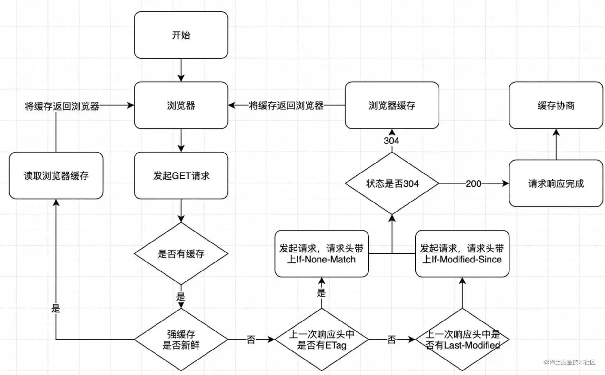

## 强缓存

> 强制缓存

### `Expires`

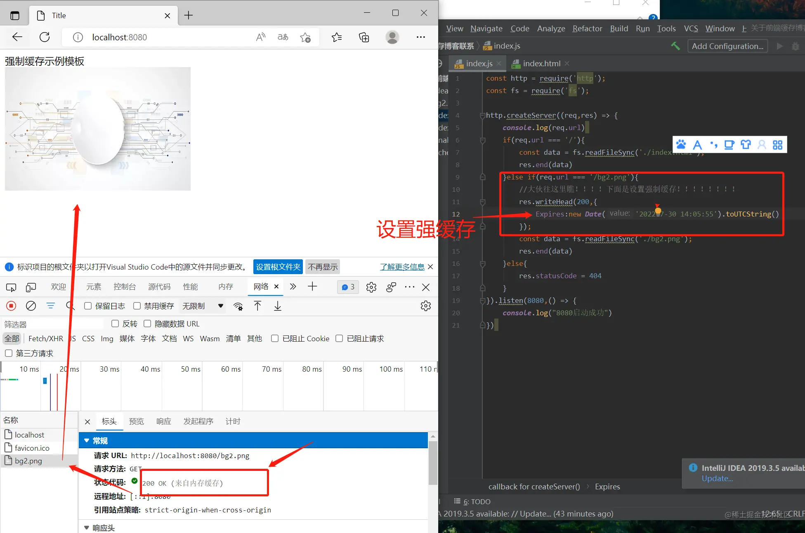

> - `Expires`字段的作用是，设定一个强缓存时间。在此时间范围内，则从内存（或磁盘）中读取缓存返回。
>   - 比如说将某一资源设置响应头为:`Expires:new Date("2022-7-30 23:59:59")`
那么，该资源在`2022-7-30 23:59:59` 之前，都会去本地的磁盘（或内存）中读取，不会去服务器请求
但是，Expires已经被废弃了。对于强缓存来说，Expires已经不是实现强缓存的首选
> - `Expires`判断强缓存是否过期的机制是:获取本地时间戳，并对先前拿到的资源文件中的`Expires`字段的时间做比较。来判断是否需要对服务器发起请求。这里有一个巨大的漏洞：“如果我本地时间不准咋办？”
> `Expires`过度依赖本地时间，如果本地与服务器时间不同步，就会出现资源无法被缓存或者资源永远被缓存的情况。所以，`Expires`字段几乎不被使用了。现在的项目中，我们并不推荐使用`Expires`，强缓存功能通常使用`cache-control`字段来代替`Expires`字段

### `Cache-control`

> 替代`Expires`的强缓存实现方法
> `Cache-control`这个字段在`http1.1`中被增加，`Cache-control`完美解决了Expires本地时间和服务器时间不同步的问题。是当下的项目中实现强缓存的最常规方法。
> `Cache-control`的使用方法页很简单，只要在资源的响应头上写上需要缓存多久就好了，单位是秒

```js
//往响应头中写入需要缓存的时间
res.writeHead(200,{
  'Cache-Control':'max-age=10'
});
```

> 在该资源第一次返回的时候开始, 往后10秒内, 如果该资源背再次请求, 则从缓存中读取

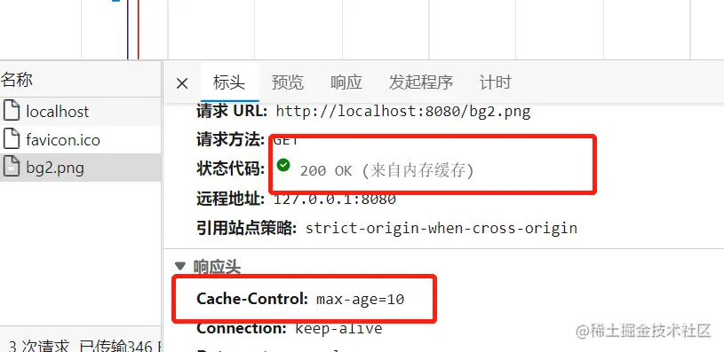

`Cache-Control`:

- `max-age=N`: `N`就是需要缓存的秒数, 从第一次请求资源开始, 往后N秒内, 资源若再次请求, 则直接从磁盘(或内存中读取), 不与服务器交互
- `max-age`: 决定客户端资源被缓存多久
- `s-maxage`: 决定代理服务器缓存的时长
- `no-cache` : 强制进行协商缓存
- `no-store` : 禁止任何缓存策略
- `public` : 资源即可以被浏览器缓存也可以被代理服务器缓存
- `private` : 资源只能被浏览器缓存

补充:

- `no-cache` 和 `no-store` 为互斥属性, 不可同时出现在`Cache-Control`中

#### `public` 和 `private`

> 一般请求


> 出现代理服务器

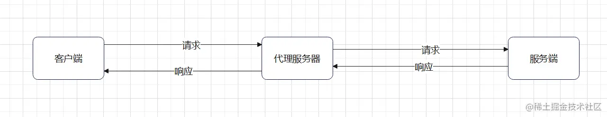

`public`: 表示资源在客户端和代理服务器都可以被缓存
`private`:

- 表示资源只能在客户端被缓存, 拒绝资源在代理服务器缓存
- 两值没有设置, 默认是`private`

> `public` 和 `private` 是互斥属性, 不可同时出现

### `max-age` 和 `s-maxage`

- max-age表示的时间资源在客户端缓存的时长，而s-maxage表示的是资源在代理服务器可以缓存的时长。
在一般的项目架构中max-age就够用。
- s-maxage因为是代理服务端的缓存时长，他必须和上面说的public属性一起使用（public属性表示资源可以在代理服务器中缓存）。

> `max-age`和`s-maxage`不互斥

`Cache-control`如何设置多个值呢？用逗号分割: `Cache-control:max-age=10000,s-maxage=200000,public`

> `Cache-control`是`Expires`的完全替代品，但是如果要考虑向下兼容的话，在`Cache-control`不支持的时候，还是要使用`Expires`

## 协商缓存

基于last-modified的协商缓存实现方式是:

1. 首先需要在服务器端读出文件修改时间
2. 将读出来的修改时间赋给响应头的last-modified字段
3. 最后设置Cache-control:no-cache

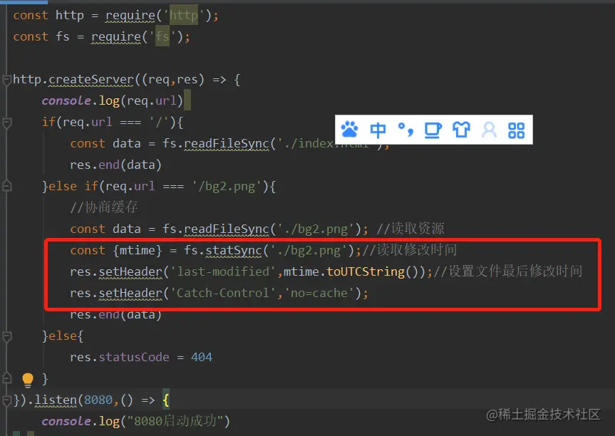

> - 第一行，读出修改时间
> - 第二行，给该资源响应头的last-modified字段赋值修改时间
> - 第三行，给该资源响应头的Cache-Control字段值设置为:no-cache.(上文有介绍，Cache-control:no-cache的意思是跳过强缓存校验，直接进行协商缓存。)

当客户端读取到last-modified的时候，会在下次的请求标头中携带一个字段:If-Modified-Since

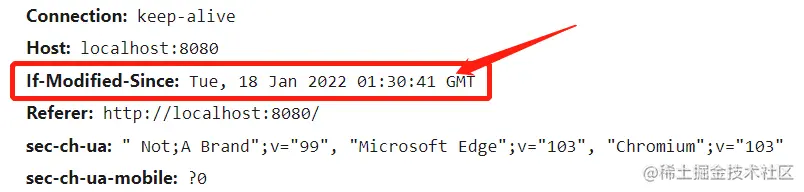

而这个请求头中的If-Modified-Since就是服务器第一次修改时候给他的时间，也就是上图中的

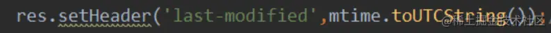

> 那么之后每次对该资源的请求，都会带上If-Modified-Since这个字段，而务端就需要拿到这个时间并再次读取该资源的修改时间，让他们两个做一个比对来决定是读取缓存还是返回新的资源

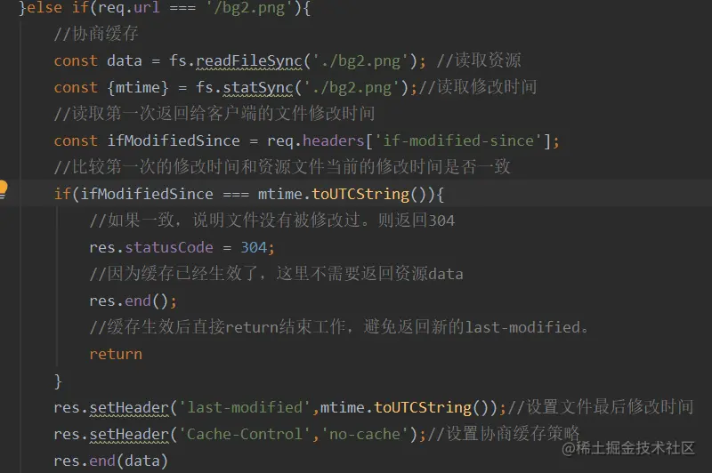

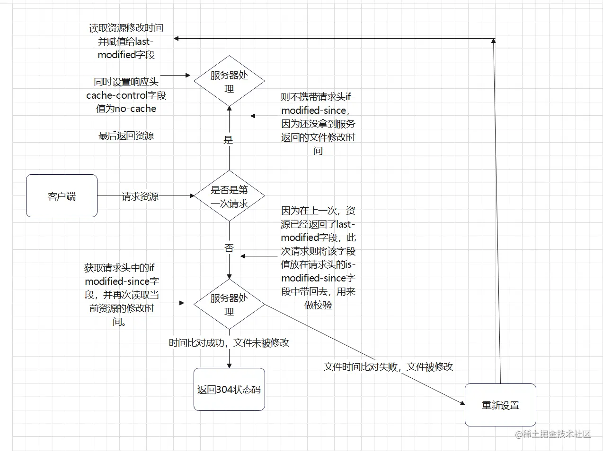

使用以上方式的协商缓存已经存在两个非常明显的漏洞。这两个漏洞都是基于文件是通过比较修改时间来判断是否更改而产生的。

1. 因为是更具文件修改时间来判断的，所以，在文件内容本身不修改的情况下，依然有可能更新文件修改时间（比如修改文件名再改回来），这样，就有可能文件内容明明没有修改，但是缓存依然失效了。
2. 当文件在极短时间内完成修改的时候（比如几百毫秒）。因为文件修改时间记录的最小单位是秒，所以，如果文件在几百毫秒内完成修改的话，文件修改时间不会改变，这样，即使文件内容修改了，依然不会
返回新的文件。
为了解决上述的这两个问题。从http1.1开始新增了一个头信息，ETag(Entity 实体标签)

## 基础ETag 的协商缓存

> - `ETag`就是将原先协商缓存的比较时间戳的形式修改成了比较文件指纹
> - `文件指纹`: 根据文件内容计算出的唯一哈希值, 文件一旦改变则指纹改变

### 流程

1. 第一次请求某资源的时候，服务端读取文件并计算出文件指纹，将文件指纹放在响应头的`etag`字段中跟资源一起返回给客户端。
2. 第二次请求某资源的时候，客户端自动从缓存中读取出上一次服务端返回的ETag也就是文件指纹。并赋给请求头的`if-None-Match`字段，让上一次的文件指纹跟随请求一起回到服务端。
3. 服务端拿到请求头中的is-None-Match字段值（也就是上一次的文件指纹），并再次读取目标资源并生成文件指纹，两个指纹做对比。如果两个文件指纹完全吻合，说明文件没有被改变，则直接返回304状态码和一个空的响应体并return。如果两个文件指纹不吻合，则说明文件被更改，那么将新的文件指纹重新存储到响应头的ETag中并返回给客户端

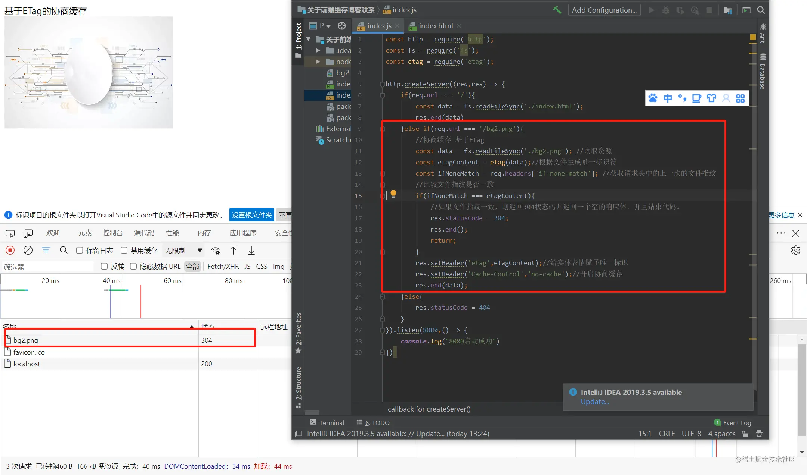

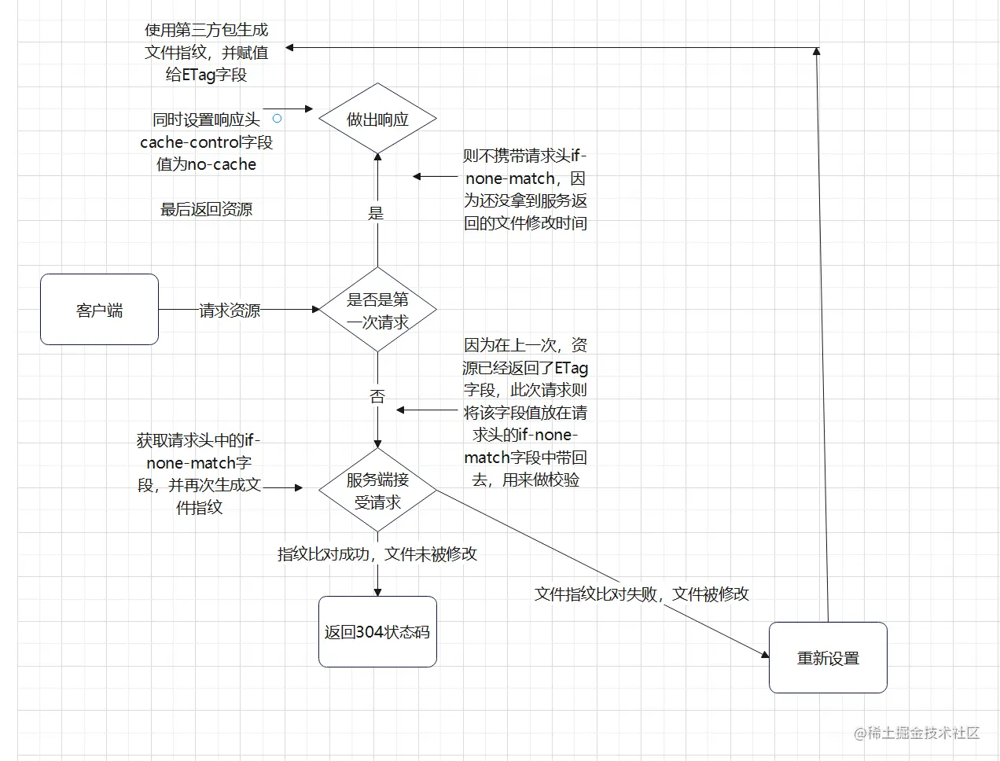

### ETag也有缺点

> ETag需要计算文件指纹这样意味着，服务端需要更多的计算开销。
> 如果文件尺寸大，数量多，并且计算频繁，那么ETag的计算就会影响服务器的性能。显然，ETag在这样的场景下就不是很适合。

> ETag有强验证和弱验证，所谓将强验证，ETag生成的哈希码深入到每个字节。哪怕文件中只有一个字节改变了，也会生成不同的哈希值，它可以保证文件内容绝对的不变。但是，强验证非常消耗计算量。
> ETag还有一个弱验证，弱验证是提取文件的部分属性来生成哈希值。因为不必精确到每个字节，所以他的整体速度会比强验证快，但是准确率不高。会降低协商缓存的有效性。

> 值得注意的一点是，不同于cache-control是expires的完全替代方案(说人话:能用`cache-control`就不要用`expires`)。ETag并不是`last-modified`的完全替代方案。而是`last-modified`的补充方案（说人话：项目中到底是用`ETag`还是`last-modified`完全取决于业务场景，这两个没有谁更好谁更坏）
