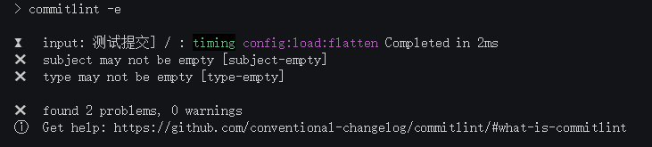

# husky

## 效果

### 正确提交 `git commit -m "refactor: 描述"`

> `refactor`: 提交类型, 由[`commitlint.config.js`](#commitlint.config.js)配置

### 错误提交 `git commit -m "测试提交"`



## 安装

```bash
npm install -D husky
npm install -D commitlint
npm install -D @commitlint/config-conventional
```

## 设置git hooks

> 在 `package.json` 添加

```jsonc
{
  "scripts": {
  // add
   "commitlint": "commitlint -e",
   "prepare": "husky install"
  },
 // add
  "husky": {
    "hooks": {
      "commit-msg": "commitlint -e $HUSKY_GIT_PARAMS"
    }
  }
}
```

```shell
# 生成.husky
npm run prepare
```

## 配置相关文件

`.husky/commit-msg`

```sh
#!/usr/bin/env sh
. "$(dirname -- "$0")/_/husky.sh"

npm run commitlint --edit $1
```

<code id="commitlint.config.js">./commitlint.config.js</code>

> [@commitlint/config-conventional](https://www.npmjs.com/package/@commitlint/config-conventional)

```js
module.exports = {
  extends: ['@commitlint/config-conventional'],
  rules: {
    'type-enum': [
      2,
      'always',
      [
        'bug', // 此项特别针对bug号，用于向测试反馈bug列表的bug修改情况
        'feat', // 新功能（feature）
        'fix', // 修补bug
        'docs', // 文档（documentation）
        'style', // 格式（不影响代码运行的变动）
        'refactor', // 重构（即不是新增功能，也不是修改bug的代码变动）
        'test', // 增加测试
        'chore', // 构建过程或辅助工具的变动
        'revert', // feat(pencil): add ‘graphiteWidth’ option (撤销之前的commit)
        'merge' // 合并分支， 例如： merge（前端页面）： feature-xxxx修改线程地址
      ]
    ]
  }
}
```
