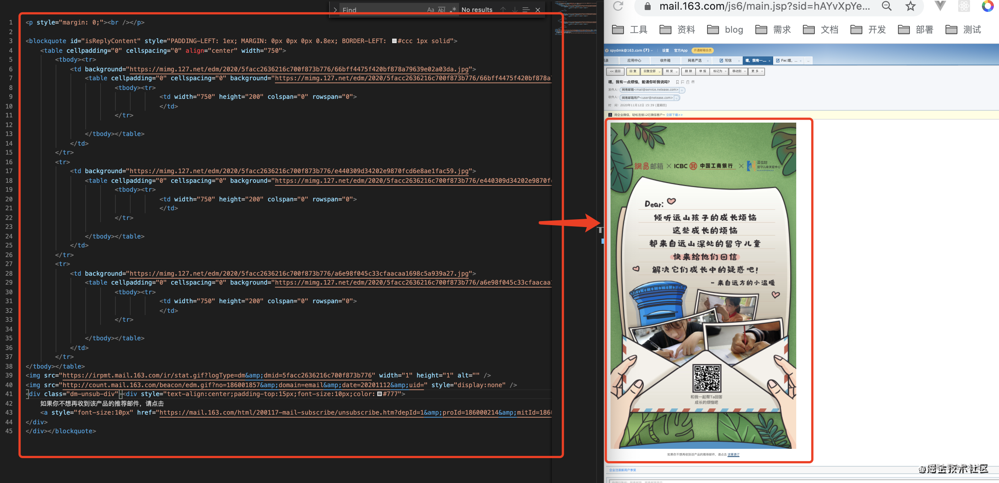
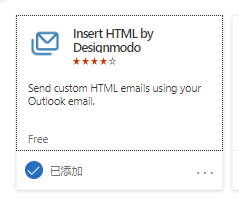
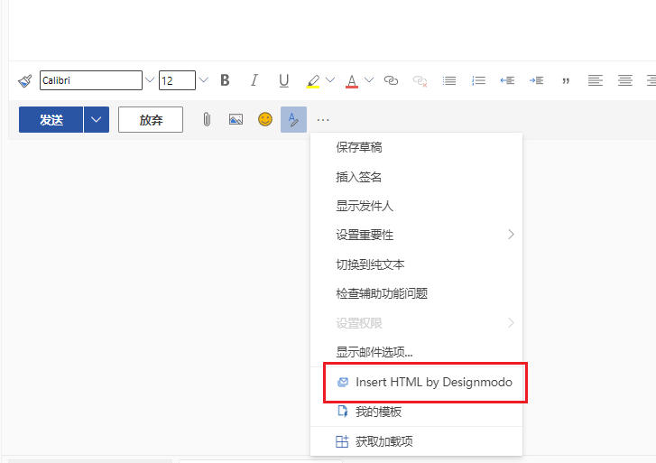
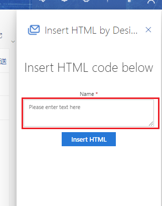

# 邮件模板

> 邮件模板是outlook等邮件系统支持html解析格式的条件下，利用前端技术通过编写HTML文件生成期望的邮件页面，从而辅助编写邮件的邮件编辑方式。
>
> 就是像写网页一样去写邮件。目前我们在163等邮箱中收到

- 知乎等网站推送的订阅期刊
- 京东等购物网站的流程通知
- 51JOB等招聘网站的职位推送
- LinkedIn等社交网站的人脉拓展

这些都是通过邮件模板的方式实现的。

当然邮件模板的使用分为

- 手动改写（适用于固定内容群发）
- 后台系统自动编辑分发（适用于即使反馈、内容随不同用户而变化的）
- ...等多种方式

## 优势

>
> 1. 适用于排版复杂
> 2. 可复月
> 3. 兼容性好
> 4. 样式鱼内容分分离开
>

## 问题

### OutLook

- 发送HTML邮件

> 无法直接编辑 HTML邮件, 要通过添加插件才可以发`HTML`的邮件

- 插件获取> 获取加载项> 搜索框输入`HTML` > 选择下图的插件

- 通过插件发送HTML邮箱:

- 输入HTMl

> 问题: 当前方法发送的HTML邮件, 转发后, 邮件样式会丢失
