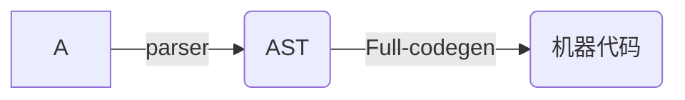

# V8编译过程

> - 主要由C++开发
> - 三个重要的组件: 解析器, 解释器, 编译器
> - 特点
>   1. 函数值声明未被调用, 不会被解析生成AST
>   2. 函数只被调用一次, bytecode直接被解释执行
>   3. 函数被调用多次, ==可能==会被标记为热点函数, 可以会被编译成机器代码
>   4. 当一个函数被定义好,不要重复调用传入不同类型的参数,会导致机械代码回退到字节码重新编译,会影响性能

### 编译过程

> 1. 词法分析(分词)
>    这个过程会将代码中的字符分解成对应有意义的代码块，这些代码块被称为词法单元（token）。
>
>    ```js
>     var a = 1;
>     => 'var' 'a' '=' '1' ';'
>    ```
>
>    - 至于空格会不会被当做词法单元（token），取决于空格在这门语言中是否有意义。
>
> 2. 语法分析(解析)
>    这个过程将词法单元流转换为一个元素逐级嵌套所组成的程序语法结构的数，被称为抽象语法树(AST);
>
> 3. 运行阶段
>    预解析 - JavaScript引擎将语法检查正常后生成的语法树复制到当前执行的上下文环境中。（包含了函数提升、变量提升等等）。
>    执行上下文 - 包含了变量对象、作用域链、this
>    变量对象：由变量申明、函数声明、参数构成。变量对象是单例实现的。
>    作用域链 - 变量对象和所有的父级作用域构成的。
>    this - 在进入上下文阶段就已经确定了 一旦进入执行代码阶段阶段，this值就不会发生过改变了。
>
> ## Babel

### 现在的V8


### 早期V8

