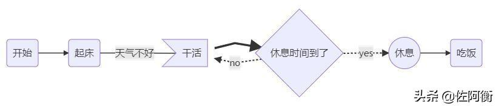

# 流程图

## 标准流程图

```flow
start=>start: 接收到消息
info=>operation: 读取信息
setCache=>operation: 更新缓存
end=>end: 处理结束

start->info->setCache->end
```


## 简易流程图

```flow
st=>start: Start
op=>operation: Your Operation
cond=>condition: Yes or No?
e=>end
st->op->cond
cond(yes)->e
cond(no)->op

```


```shell
# ```flow
start=>start: API请求
cache=>operation: 读取Redis缓存
cached=>condition: 是否有缓存？
sendMq=>operation: 发送MQ，后台服务更新缓存
info=>operation: 读取信息
setCache=>operation: 保存缓存
end=>end: 返回信息

start->cache->cached
cached(yes)->sendMq
cached(no)->info
info->setCache
setCache->end
sendMq->end
```

> 基本语法：
>
> 定义模块 id=>关键字: 描述 （“描述”的前面必须有空格，“=>” 两端不能有空格）
> 关键字：
> start 流程开始，以圆角矩形绘制
> opearation 操作，以直角矩形绘制
> condition 判断，以菱形绘制
> subroutine 子流程，以左右带空白框的矩形绘制
> inputoutput 输入输出，以平行四边形绘制
> end 流程结束，以圆角矩形绘制
> 定义模块间的流向：
> 模块1 id->模块2 id ：一般的箭头指向
> 条件模块id (描述)->模块id(direction) ：条件模块跳转到对应的执行模块，并指定对应分支的布局方向


```shell
# ```flow
st=>start: 开始
ipt=>inputoutput: 输入一个x
op=>operation: 处理加工x+1
cond=>condition: 溢出（是或否？）
sub=>subroutine: 子流程
io=>inputoutput: 输出x
ed=>end: 结束

st->ipt->op->cond
cond(yes)->io->ed
cond(no)->sub->io->ed
```


```shell
# ```flow
st=>start: Start|past:>http://www.google.com[blank]
e=>end: End:>http://www.google.com
op1=>operation: get_hotel_ids|past
op2=>operation: get_proxy|current
sub1=>subroutine: get_proxy|current
op3=>operation: save_comment|current
op4=>operation: set_sentiment|current
op5=>operation: set_record|current

cond1=>condition: ids_remain空?
cond2=>condition: proxy_list空?
cond3=>condition: ids_got空?
cond4=>condition: 爬取成功??
cond5=>condition: ids_remain空?

io1=>inputoutput: ids-remain
io2=>inputoutput: proxy_list
io3=>inputoutput: ids-got

st->op1(right)->io1->cond1
cond1(yes)->sub1->io2->cond2
cond2(no)->op3
cond2(yes)->sub1
cond1(no)->op3->cond4
cond4(yes)->io3->cond3
cond4(no)->io1
cond3(no)->op4
cond3(yes, right)->cond5
cond5(yes)->op5
cond5(no)->cond3
op5->e
```

## 样式流程图

> 基本语法：
>
> graph 指定流程图方向：graph LR 横向，graph TD 纵向
> 元素的形状定义：
>
> - id[描述] 以直角矩形绘制
> - id(描述) 以圆角矩形绘制
> - id{描述} 以菱形绘制
> - id>描述] 以不对称矩形绘制
> - id((描述)) 以圆形绘制
>
> 线条定义：
> A-->B 带箭头指向
> A---B 不带箭头连接
> A-.-B 虚线连接
> A-.->B 虚线指向
> A==>B 加粗箭头指向
> A--描述---B 不带箭头指向并在线段中间添加描述
> A--描述-->B 带描述的箭头指向
> A-.描述.->B 带描述的虚线连指向
> A==描述==>B 带描述的加粗箭头指向
> 子流程图定义
> subgraph title
> graph direction
> end


```shell
graph LR
A(开始) -->B(起床)
B --天气不好--- C>干活]
C ==> D{休息时间到了}
D -.yes.-> E((休息))
D -.no.-> C
E --> F(吃饭)
```

```shell
# ```mermaid
graph LR
A(开始) -->B(起床)
B --天气不好--- C>干活]
C ==> D{休息时间到了}
D -.yes.-> E((休息))
D -.no.-> C
E --> F(吃饭)
```
