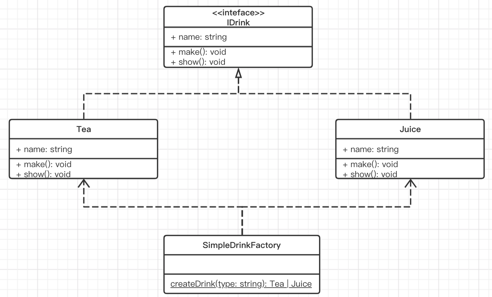
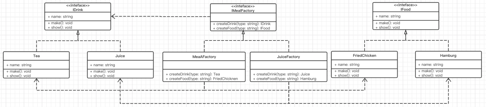

# 工厂模式

> 工厂，在现实中是生产产品的地方。在 oop 中，就是生产对象的地方。其核心是封装一个生产（new）行为。

## 简单工厂

> - 假如现在你运营了一间餐厅，客人如果要喝饮料，自己制作一杯就好，比如自己制作一杯茶或者一杯果汁。你觉得方便，顾客自己动手，丰衣足食，给你省了很大成本。顾客也觉得方便，想喝的时候自己就可以做，不用麻烦任何人，也不用等待。
> - 问题: 顾客原本制作茶（new Tea()）时我们是提供的本地茶叶冲泡的茶，但是成本太高，于是想换为绿茶茶包来制作（new GreenTea()）。
>   - 需要通知所有泡茶的顾客更改他们的制作方式，这样的话，成本是不是太大了呢？ 假设我提供一个饮品机器，能够为我们生产茶和果汁，用户想要什么饮品，按一下对应的按钮就可以。 我们来设计一下 UML 类图：



这里饮品我们用的接口，当然也可以用一个抽象类。下面是代码实现：

```ts

interface IDrink {
    name: string; // 饮品名称
    make(): void; // 制作饮品
    show(): void; // 展示饮品
}

// 茶
class Tea implements IDrink {
    name: string;
    constructor(name:string) {
        this.name = name;
        this.make();
    }
    make(): void {
        console.log('make tea');
    }
    show(): void {
        console.log(`this is ${this.name}`)
    }
}

// 果汁
class Juice implements IDrink {
    name: string;
    constructor(name:string) {
        this.name = name;
        this.make();
    }
    make(): void {
        console.log('make juice');
    }
    show(): void {
        console.log(`this is ${this.name}`)
    }
}

class SimpleDrinkFactory {
    static createDrink(type: string):IDrink  {
        switch (type) {
            case 'tea':
                return new Tea('tea');
            case 'juice':
                return new Juice('juice');
            default:
                return new Juice('juice');
        }
    }
}

// 告诉简单工厂想要一杯茶
const tea: Tea = SimpleDrinkFactory.createDrink('tea');
tea.show();
// 告诉简单工厂想要一杯果汁
const juice: Juice = SimpleDrinkFactory.createDrink('juice');
juice.show();
```


如果我们要把茶换成绿茶，只需新增一个绿茶类，并且在工厂中对茶的生产做一个修改即可，而不需要修改原来调用工厂生产茶的逻辑。

```javascript
class GreenTea extends Tea {
    make(): void {
        console.log('make green tea');
    }
}

class SimpleDrinkFactory {
    static createDrink(type: string): : Tea | Juice  {
        switch (type) {
            case 'tea':
                return new GreenTea('green tea');
            case 'juice':
                return new Juice('juice');
            default:
               return new Juice('juice');
        }
    }
}
```

>对产品的生产做了一层封装，隔离了用户和产品的直接关系，用户只需要和工厂打交道即可。
>
>注意：
>
>1. 理论上，简单工厂可以生成任意不相关的对象(返回 any)，实际上我们还是会把具有相同特征（IDrink）的产品放在一块。
>2. 简单工厂的灵活性不强，不支持传入不同的参数。比如调用工厂时传入不同的参数，让其在生成产品时去调用，这种在 ts 是很难做到的，但你要说在 js，那就很 easy 了。
>3. 扩展很麻烦，比如你要新增一种饮品类型，这里就得修改工厂，改造你的饮品机器，加一个按键，违反了开闭原则。 其实简单工厂不属于设计模式的一种，但他的这种思想还是很强大的，运用也很广泛，为我们提供了一种最简单的封装创建行为的方式。

## 工厂方法模式

> - 工厂方法模式(Factory Method Pattern)又称为工厂模式，工厂父类负责定义创建产品对象的公共接口，而工厂子类则负责生成具体的产品对象，即通过不同的工厂子类来创建不同的产品对象。
>
> - 简单工厂扩展时需要修改工厂。这是因为再简单工厂内部我们用到了所有具体的产品，所以我们应该继续抽象，让我们的创建行为依赖一个抽象的工厂，而具体的创建行为由一个具体的工厂子类来实现。


```typescript
interface IDrinkFactory {
    createDrink(): IDrink;
}

class TeaFactory implements IDrinkFactory {
    createDrink(): Tea {
        return new Tea('tea');
    }
}

class JuiceFactory implements IDrinkFactory {
    createDrink(): Juice {
        return new Juice('juice');
    }
}

// 告诉工厂想要一杯茶
const tea = new TeaFactory().createDrink();
tea.show();
// 告诉工厂想要一杯果汁
const juice = new JuiceFactory().createDrink();
juice.show();
```

> 这就好比新增一种饮品，我在新增一台机器即可，符合开闭原则。
>
> 但是如果我的饮品种类很多，我就要增加很多机器，假设我还有生产食物的需求，我也得为食物生产定制很多的机器。那么我的管理成本会越来越大。

## 抽象工厂模式

> 其实顾客消费时，既有可能消费饮品，也有可能消费食物，如果我们的抽象工厂同时提供这两种产品的创建，那么我们所需要实现的具体工厂就会少很多。也就是我们的工厂支持不同的产品系创建。



```ts
interface IDrink {
    name: string; // 饮品名称
    make(): void; // 制作饮品
    show(): void; // 展示饮品
}

// 茶
class Tea implements IDrink {
    name: string;

    constructor(name:string) {
        this.name = name;
        this.make();
    }

    make(): void {
        console.log('make tea');
    }

    show(): void {
        console.log(`this is ${this.name}`);
    }
}

// 果汁
class Juice implements IDrink {
    name: string;

    constructor(name:string) {
        this.name = name;
        this.make();
    }

    make(): void {
        console.log('make juice');
    }

    show(): void {
        console.log(`this is ${this.name}`);
    }
}

interface IFood {
    name: string;
    make(): void; // 制作食品
    show(): void; // 展示食品
}

// 炸鸡
class FriedChicken implements IFood {
    name: string;

    constructor(name:string) {
        this.name = name;
        this.make();
    }

    make(): void {
        console.log('make FriedChicken');
    }

    show(): void {
        console.log(`this is ${this.name}`);
    }
}

// 汉堡
class Hamburg implements IFood {
    name: string;

    constructor(name:string) {
        this.name = name;
        this.make();
    }

    make(): void {
        console.log('make hamburg');
    }

    show(): void {
        console.log(`this is ${this.name}`);
    }
}

interface IMealFactory {
    createDrink(): IDrink;
    createFood(): IFood;
}

class MealAFactory implements IMealFactory {
    createDrink(): Tea {
        return new Tea('tea');
    }

    createFood(): FriedChicken {
        return new FriedChicken('fried chicken');
    }
}

class MealBFactory implements IMealFactory {
    createDrink(): Juice {
        return new Juice('juice');
    }

    createFood(): Hamburg {
        return new Hamburg('hamburg');
    }
}

const mealAFactory = new MealAFactory();
mealAFactory.createDrink().show();
mealAFactory.createFood().show();
const mealBFactory = new MealBFactory();
mealBFactory.createDrink().show();
mealBFactory.createFood().show();
```

> 抽象工厂解决了创建不同产品簇的问题，不过抽象工厂在扩展时仍然会产生大量的实体工。

## 小结

> 从工厂模式的三种形态中，我们可以看到。
>
> 越抽象就越利于扩展，但同时也增大了代码结构的复杂性和管理难度，另外，越抽象，有时候就意味着约束力更弱。
>
> 比如这里具体工厂生产的产品类型，我们使用的具体产品类型来约束，而不是抽象的产品接口来约束，虽然第二种方法扩展和修改起来更方便，但是代码的约束力更弱，可能会写出不符合预期的代码。
>
> 没有完美的设计模式，只有合适的设计方案，不要在一开始就追求过度设计。我们只要理解工厂模式的核心就在于封装 new 这个行为。
