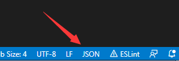
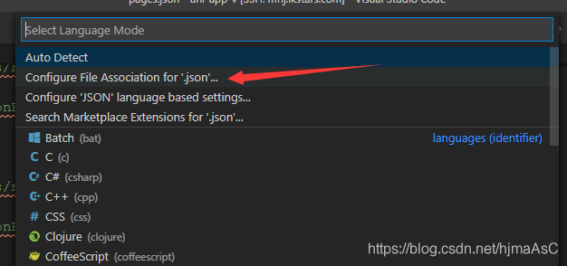
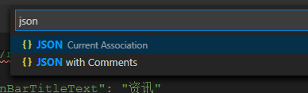

#vscode问题

## CPU占用过高

> rg.exe占用过高

1. search.followSymlinks 取消该配置项的勾选
2. files.exclude 添加``node_modules`, 这样子就不会加载该文件夹, 可以减少加载该导致的资源的浪费

## vscode中Comments are not permitted in JSON的解决办法

> 1. 点击vscode 右下角的 ==JOSN==
>
>    
>
> 2. 选择Configure File Associaton for '.josn'
>
> 
>
> 3. 输入json, 选择JSON with Comments
>
>    

