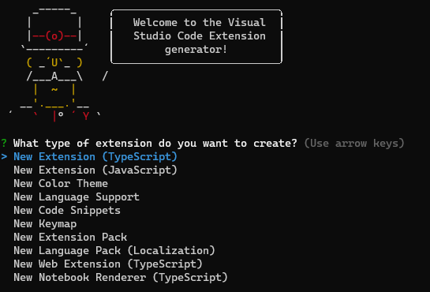

# vsocde 插件开发

```shell
npm install -g yo generator-code
yo code
```



对应意思:

- 新的插件（Typescript）
- 新的插件（JavaScript）
- 新的主题颜色
- 新的语言支持
- 新的代码片段
- 新的键值绑定
- 新的插件包
- 新的语言包（本土化）

```json
{
  "name": "test-extension", // 插件的名字
  "displayName": "test-extension", // 在插件市场展示的名字
  "description": "vscode extension sample", // 插件描述
  "version": "0.0.1", // 插件版本
  "engines": { // 最低支持 vscode 的版本
    "vscode": "^1.52.0"
  },
  "categories": [ // 插件的类别，用于在插件市场做区分
    "Other"
  ],
  "activationEvents": [ // 插件激活的事件列表，可以有多个触发机制，所以是数组形式
    "onCommand:test-extension.helloWorld",
    // "*"  // 插件一开始就激活并注册事件
  ],
  "main": "./extension.js", // 插件主入口
  "contributes": { // 贡献点，用于拓展插件功能的配置项，这里不会细讲，先用 command 举例
    "commands": [
      {
        "command": "test-extension.helloWorld",
        "title": "Hello World"
      }
    ]
  },
  "scripts": {
    "vscode:prepublish": "pnpm run package",
    "compile": "webpack",
    "watch": "webpack --watch",
    "package": "webpack --mode production --devtool hidden-source-map",
    "compile-tests": "tsc -p . --outDir out",
    "watch-tests": "tsc -p . -w --outDir out",
    "pretest": "pnpm run compile-tests && pnpm run compile && pnpm run lint",
    "lint": "eslint src --ext ts",
    "test": "node ./out/test/runTest.js"
  },
  "devDependencies": {
    "@types/vscode": "^1.72.0",
    "@types/glob": "^8.0.0",
    "@types/mocha": "^10.0.0",
    "@types/node": "16.x",
    "@typescript-eslint/eslint-plugin": "^5.38.1",
    "@typescript-eslint/parser": "^5.38.1",
    "eslint": "^8.24.0",
    "glob": "^8.0.3",
    "mocha": "^10.0.0",
    "typescript": "^4.8.4",
    "ts-loader": "^9.4.1",
    "webpack": "^5.74.0",
    "webpack-cli": "^4.10.0",
    "@vscode/test-electron": "^2.1.5"
  }
}

```
