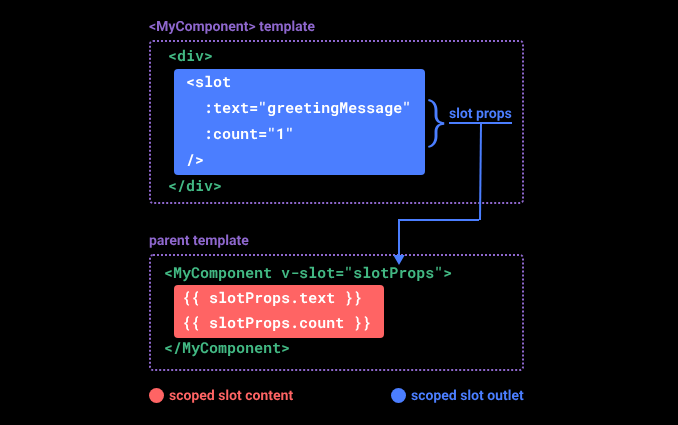
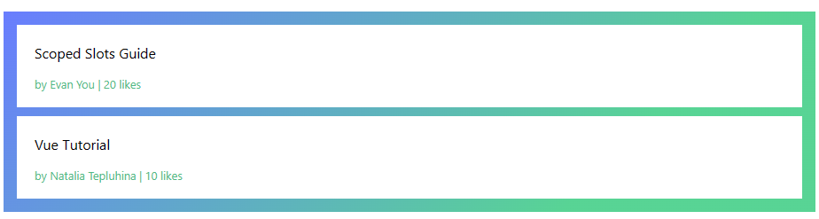

# [`作用域插槽`](https://cn.vuejs.org/guide/components/slots.html#scoped-slots)



- 传入渲染  `<MyComponent />` 里的 `slot` 的属性 的模板

## eg

FancyList.vue

```html
<script setup>
import { ref } from 'vue'

const props = defineProps(['api-url', 'per-page'])

const items = ref([])

// mock remote data fetching
setTimeout(() => {
  items.value = [
    { body: 'Scoped Slots Guide', username: 'Evan You', likes: 20 },
   { body: 'Vue Tutorial', username: 'Natalia Tepluhina', likes: 10 }
  ]
}, 1000)
</script>

<template>
  <ul>
    <li v-if="!items.length">
      Loading...
    </li>
    <li v-for="item in items">
      <slot name="item" v-bind="item"/>
    </li>
  </ul>
</template>

<style scoped>
  ul {
    list-style-type: none;
    padding: 5px;
    background: linear-gradient(315deg, #42d392 25%, #647eff);
  }
  li {
    padding: 5px 20px;
    margin: 10px;
    background: #fff;
  }
</style>
```

```html
<!-- 使用 -->
<script setup>
import FancyList from './FancyList.vue'
</script>

<template>
  <FancyList api-url="url" :per-page="10">
    <template #item="{ body, username, likes }">
      <div class="item">
        <p>{{ body }}</p>
        <p class="meta">by {{ username }} | {{ likes }} likes</p>
      </div>
    </template>
  </FancyList>
</template>

<style scoped>
.meta {
  font-size: 0.8em;
  color: #42b883;
}
</style>
```


