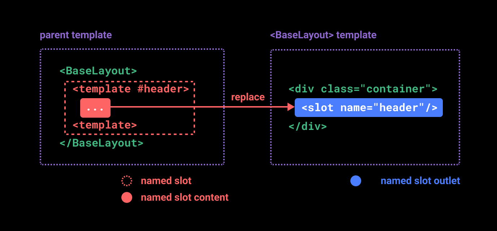

# [`具名插槽`](https://cn.vuejs.org/guide/components/slots.html#named-slots)

- 默认命名: `default`
- 简写: `v-slot:name` => `#name`



```html
<!-- 组件 -->
<div class="container">
  <header>
    <slot name="header"></slot>
  </header>
  <main>
    <slot></slot>
  </main>
  <footer>
    <slot name="footer"></slot>
  </footer>
</div>


<!-- 使用组件 -->
<BaseLayout>
  <template #header>
    <h1>Here might be a page title</h1>
  </template>

  <template #default>
    <p>A paragraph for the main content.</p>
    <p>And another one.</p>
  </template>

  <template #footer>
    <p>Here's some contact info</p>
  </template>
</BaseLayout>
<!-- 使用组件(简写) -->
<BaseLayout>
  <template #header>
    <h1>Here might be a page title</h1>
  </template>

  <!-- 隐式的默认插槽 -->
  <p>A paragraph for the main content.</p>
  <p>And another one.</p>

  <template #footer>
    <p>Here's some contact info</p>
  </template>
</BaseLayout>

<!-- 渲染结果 -->
<div class="container">
  <header>
    <h1>Here might be a page title</h1>
  </header>
  <main>
    <p>A paragraph for the main content.</p>
    <p>And another one.</p>
  </main>
  <footer>
    <p>Here's some contact info</p>
  </footer>
</div>
```

- 当组件同时接受默认插槽和具名插槽, `#default` 会隐性转换为默认的插槽的内容
