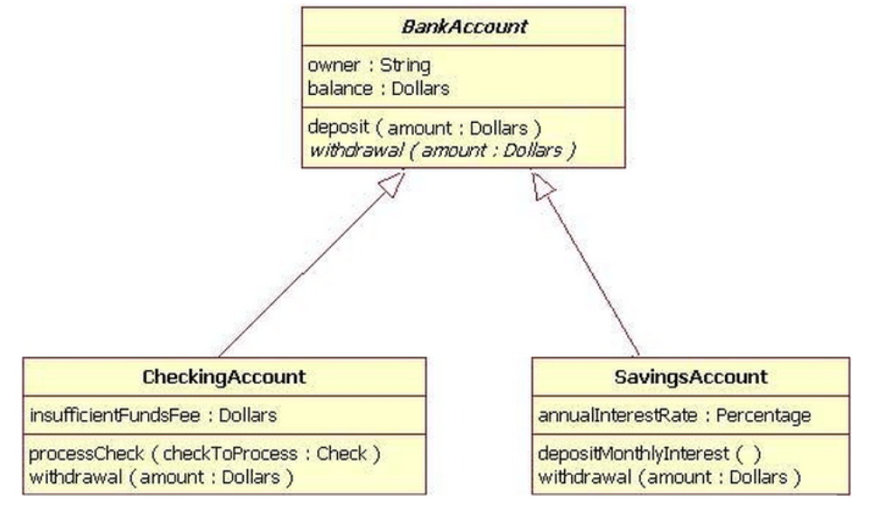
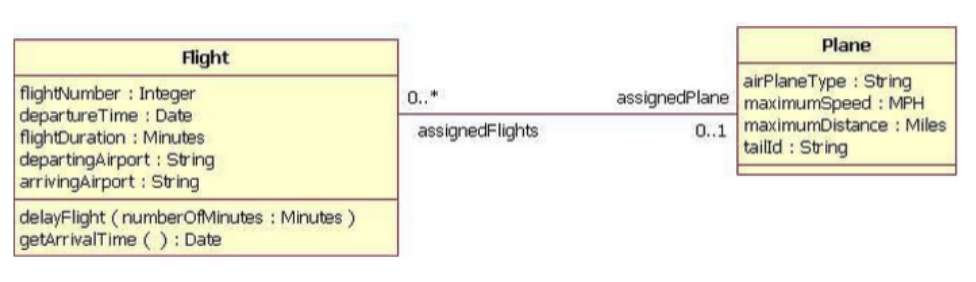

# UML类图

> - 虚线+箭头 : 依赖(Dependency)
> - 虚线+空心三角 : 实现接口
> - 实线+箭头 : 关联 ( Association )
> - 实线+空心右三角 :  泛化(继承, extends)
> - 实线+空心菱形 : 聚合 ( Aggregation )
> - 实线+实心菱形 : 组合
>
> - 基数 ：连线两端的数字表明这一端的类可以有几个实例，比如：一个鸟应该有两只翅膀。
>
>
>
>   其他: 如果一个类 可能有无数个实例，则就用‘n’来表示。关联、聚合、组合是有基数的

## 类（Class）

> 三层矩形框表示:
>
> - 第一层显示类的名称，如果是抽象类，则就用斜体显示
>
> - 第二层是字段和属性
>
> - 第三层是类的方法
>
> 符号:
>
> - ‘+’ : public
> - ‘-’ : private
> - ‘#’ : protected

## 接口

> :两层矩形框:
>
> 与类图的区别主要是顶端有<>显示 。
>
> - 第一行是接口名称。
>
> - 第二行是接口方法。

## 从非接口类继承

## 双向关联

## 单向关联

## 软件包

## 序列化

## 关联实例=>产生实例

> 水平的连线还是表示上面所说的关联, 但从关联连线中引伸出来的虚线, 这意味当Flight类的一个实例关联到 FrequentFlyer 类的一个实例时，将会产生 MileageCredit 类的一个实例.

## 不随着另一个实例创建销毁

> 带菱形的箭头表示基本聚合, 由上图知道, Wheel类扮演wheels角色, 聚合4个到Car对象里面去, 空心的菱形表示Wheel对象并不随Car的创建而创建,销毁而销毁

## 随着另一个实例创建销毁

> 意义和上面类似, 唯一不同的是, 实心菱形表示Department对象随Company对象的创建而创建,销毁而销毁

## 反射关联

> 表示反射关联, 显示一个Employee类如何通过manager / manages角色与它本身相关。当一个类关联到它本身时，这并不意味着类的实例与它本身相关，而是类的一个实例与类的另一个实例相关

