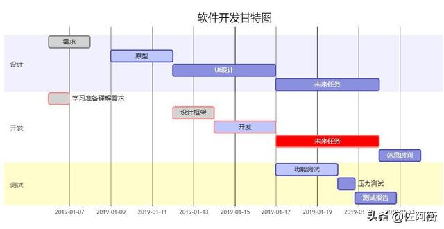

# 甘特图

> 使用 mermaid 解析语言，在开头使用关键字 gantt 指明
> deteFormat 格式 指明日期的显示格式
> title 标题 设置图标的标题
> section 描述 定义纵向上的一个环节
> 定义步骤：每个步骤有两种状态 done（已完成）/ active（执行中）
>
> - 描述: 状态,id,开始日期,结束日期/持续时间
> - 描述: 状态[,id],after id2,持续时间
> - crit ：可用于标记该步骤需要被修正，将高亮显示
> - 如果不指定具体的开始时间或在某个步骤之后，将默认依次顺序排列

> 甘特图视图有两个部分、树形任务列表及含时间显示的任务条视图

• 左边部分，也可以编辑任务信息，包括任务的开始、结束时间，优先级，进度。
• 右边部分，可以看到任务条，不同颜色表示不同的优先级，两个任务之间的联系，表示这两个任务有依赖关系。

除了浏览任务信息外，我们还可以：

1. 更改时间轴到小时、天、周、星期几、月。
2. 将鼠标滑动到任务上，显示其所有详情，如开始、结束时间，优先级，进度。
3. 选中任务进行移动可以更改起始时间。
4. 选中任务的一端进行移动，可以更改任务时长。
5. 选中任务开始或结束端的小圆圈，可以将其链接到其他任何任务上，然后设置之间的依赖关系。

备注
依赖关系的类型：

- 截止日期-至-开始日期, 任务A的开始日期 不得早于任务B的截止日期。
- 开始日期-至-截止日期, 任务A的截止日期 不得早于任务B的开始日期。
- 开始日期-至-开始日期, 任务A的开始日期 不得早于任务B的开始日期。
- 截止日期-至-截止日期, 任务A的截止日期 不得早于任务B的截止日期。



```shell
gantt
dateFormat YYYY-MM-DD

title 软件开发甘特图

section 设计
需求:done,des1, 2019-01-06,2019-01-08
原型:active,des2, 2019-01-09, 3d
UI设计:des3, after des2, 5d
未来任务:des4, after des3, 5d

section 开发
学习准备理解需求:crit, done, 2019-01-06,24h
设计框架:crit, done, after des2, 2d
开发:crit, active, 3d
未来任务:crit, 5d
休息时间:2d

section 测试
功能测试:active, a1, after des3, 3d
压力测试:after a1, 20h
测试报告: 48h
```

```shell
# ```mermaid
gantt
dateFormat YYYY-MM-DD

title 软件开发甘特图

section 设计
需求:done,des1, 2019-01-06,2019-01-08
原型:active,des2, 2019-01-09, 3d
UI设计:des3, after des2, 5d
未来任务:des4, after des3, 5d

section 开发
学习准备理解需求:crit, done, 2019-01-06,24h
设计框架:crit, done, after des2, 2d
开发:crit, active, 3d
未来任务:crit, 5d
休息时间:2d

section 测试
功能测试:active, a1, after des3, 3d
压力测试:after a1, 20h
测试报告: 48h
```
