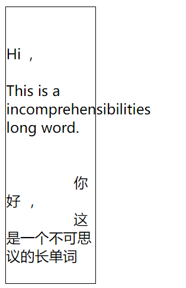
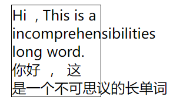
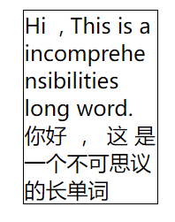

# word-break & word-wrap & white-space

## white-space

> 控制空白字符的显示, 控制是否换行
>
> `normal | nowrap | pre | pre-wrap | pre-line`

```html
<style>
 div#box {
  border: 1px solid #000;
  width: 100px;
    white-space: normal;
 }
</style>
<div id="box">
  Hi&nbsp;&nbsp;,
  This is a incomprehensibilities long word.
  <br>
  你好&nbsp;&nbsp;，
  这 是一个不可思议的长单词
</div>
```

| `normal`   |  | 默认                                           |
| ---------- | ------------------------------------------------------------ | ---------------------------------------------- |
| `nowrap`   |  | 只有`<br>`才可以换行, <br>空格和换行符失效     |
| `pre`      |  | 空格和换行符全都被保留了下来<br>自动换行还是没 |
| `pre-wrap` |  | 保留空格和换行符, 可自动换行                   |
| `pre-line` |  | 空格被合并, 换行符发挥作用                     |

## word-break

> 控制单词如何被拆分换行
>
> `normal | break-all | keep-all`

```html
<style>
 div#box {
  border: 1px solid #000;
  width: 100px;
  word-break: normal;
 }
</style>

<body>
 <div id="box">
  Hi&nbsp;&nbsp;,
  This is a incomprehensibilities long word.
  <br>
  你好&nbsp;&nbsp;，
  这 是一个不可思议的长单词
 </div>
</body>
```

| `normal`    |  | 默认                                                   |
| ----------- | ------------------------------------------------------------ | ------------------------------------------------------ |
| `break-all` |  | 所有单词碰到边界一律拆分换行                           |
| `keep-all`  |  | **所有“单词”一律不拆分换行**, <br>只有空格可以触发换行 |

## word-wrap ( overflow-wrap )

> 控制单词如何换行
>
> `normal | break-word`

### break-word


