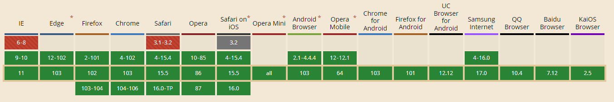

# `currentColor`

- `currentColor`经常被叫做『第一个CSS变量』
- `currentColor`的值等于当前元素的`color`属性值，看上去有些像继承。它可以被应用于任何可以接收color值的属性中，比如`border-color`, `background`, `box-shadow`等。
- 当在同一个CSS选择器中，需要将同一个颜色值应用到多个接收color值的CSS属性上（例如`border-color`，`background`, `box-shadow`）时，`currentColor`就派上用场了。

```html
<aside class="success">
  Lorem ipsum dolor sit amet, consectetur adipiscing elit. Nullam auctor tellus ac tempus sollicitudin. Mauris quam eros, viverra eget pulvinar at, scelerisque non velit.
</aside>

<aside class="warning">
Vestibulum dapibus, libero non venenatis suscipit, elit libero scelerisque odio, nec laoreet ipsum sem sed nibh. Nulla facilisi.  
</aside>

<aside class="error">
Vivamus rhoncus dignissim diam, id dictum lorem tincidunt sit amet. Cras et eros urna. Proin pulvinar enim a congue porttitor.
</aside>
```

```css
<style>
 aside {
  border-left: 5px solid currentColor;
  box-shadow: 5px 5px 10px currentColor;
  margin-bottom: 20px;
}
.success {
  color: darkgreen;
}
.warning {
  color: darkgoldenrod;
}
.error {
  color: darkred;
}
```

<aside class="success">
  Lorem ipsum dolor sit amet, consectetur adipiscing elit. Nullam auctor tellus ac tempus sollicitudin. Mauris quam eros, viverra eget pulvinar at, scelerisque non velit.
</aside>

<aside class="warning">
Vestibulum dapibus, libero non venenatis suscipit, elit libero scelerisque odio, nec laoreet ipsum sem sed nibh. Nulla facilisi.  
</aside>

<aside class="error">
Vivamus rhoncus dignissim diam, id dictum lorem tincidunt sit amet. Cras et eros urna. Proin pulvinar enim a congue porttitor.
</aside>

<style>
 aside {
  border-left: 5px solid currentColor;
  box-shadow: 5px 5px 10px currentColor;
 margin-bottom: 20px;
}
.success {
  color: darkgreen;
}
.warning {
  color: darkgoldenrod;
}
.error {
  color: darkred;
}

</style>

## 兼容性


