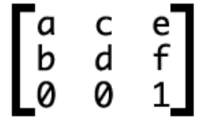

# setTransform

> 设置矩阵变换当前
> 此方法和transform()方法的区别在于，后者不会完全重置已有的变换，而是累加

`context.setTransform(a, b, c, d, e, f)`
参数| 类型 |作用
|:----|:----|:----|
`a`| `Number` |水平缩放
`b`| `Number` |水平斜切
`c`| `Number` |垂直斜切
`d`| `Number` |垂直缩放
`e`| `Number` |水平位移
`f`| `Number` |垂直位移


```js
context.setTransform(1, 0, 1, 1, 0, 0);
context.fillRect(10, 20, 100, 100);
```


