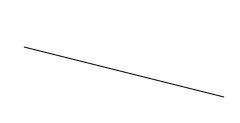
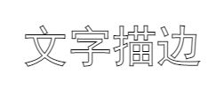

# stroke_

## stroke

> 对路径进行描边

```js

context.stroke();
context.stroke(path);
```

参数 `pathObject` :指Path2D对象(IE浏览器不支持)

```js
context.moveTo(50, 50);
context.lineTo(250, 100);
// 描边
context.stroke();
```



## strokeRect

> 矩形描边

```js
context.strokeRect(x, y, width, height);
```

| 参数   | 类型   | 作用                 |
| :----- | :----- | :------------------- |
| x      | Number | 矩形的起点横坐标 |
| y      | Number | 矩形的起点纵坐标 |
| width  | Number | 矩形的宽度       |
| height | Number | 矩形的高度       |

```js
// 像素宽矩形描边
context.lineWidth = 2;
context.strokeRect(75, 25, 150, 100);
```


## strokeText

> 文字描边, 居中描边

```js
context.strokeText(text, x, y [, maxWidth]);
```

|参数| 类型 | 参数|
|:----|:----|:----|
text | String 用来描边的文本信息。
x | Number |描边文本的起点横坐标。
y | Number |描边文本的起点纵坐标。
maxWidth | （可选）Number | 填充文本最大宽度 (超过最大宽度, 通过压缩每个文本宽度)

```js
// 文字描边
context.font = '50px STHeiti, SimHei';
context.strokeText('文字描边', 50, 90);
```


