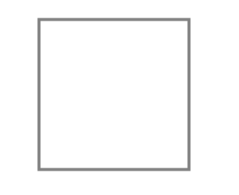

# rect

> `CanvasRenderingContext2D.rect()` 绘制矩形路径
> `rect()`绘制出来的仅仅是路径，和`arc()`、`ellipse()`方法是一样的。需要你需要填充，还需要执行`fill()`方法，如果要描边，还需要执行`stroke()`方法。实际上，对于矩形，填充和描边有现成的方法，这个是为矩形独有的，为`fillRect()`和`strokeRect()`

```js
context.rect(x, y, width, height);
```

参数 | 类型 | 作用
|:----|:----|:----|
`x` | `Number`| 矩形路径的起点横坐标
`y` | `Number`| 矩形路径的起点纵坐标
`width` | `Number`| 矩形的宽度
`height` | `Number`| 矩形的高度

```js
// 矩形
context.rect(100, 25, 100, 100);
context.stroke();
```


