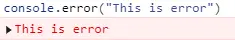
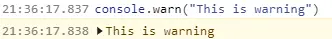
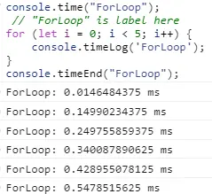

# console

- <https://developer.mozilla.org/zh-CN/docs/Web/API/Console_API>

## trace

- 输出一个堆栈跟踪

```js
 function foo() {
   function bar() {
    console.trace();
   }
   bar();
  }
  foo();
```


## table

- `console.table({ ... })`


## error

- `console.err(“This is error”)`


## warn

- `console.warn()`



## Time & timelog & timeEnd

- `console.time()、console.timeLog()、console.timeEnd()`: 用来进行程序计时


## assert

- `console.assert(assert_statement,message)` : 设定断言, 如果assert_statement 为false 显示message消息
- 只有`assert_statement` 为true 的时候才会打印出来


## count & countReset

- `console.count()` : 统计参数标签计数
- `console.countReset()`: 重置对应标签的计数


### group & groupEnd

- 给log用缩进进行分组

```js
 let i = 9;
  console.group()
  while (i--) {
   console.log(i);
   if (i % 3 === 0) {
    console.groupEnd();
    console.group()
   }
  }
```


## groupCollapsed & groupEnd

- `groupCollapsed` 和 group类似, 默认分组是关闭的

```js
 let i = 9;
  console.groupCollapsed('group')
  while (i--) {
   console.log({ i });
   if (i % 3 === 0) {
    console.groupEnd();
    console.groupCollapsed('group')
   }
  }
```


## info &log

- 控制台打印 信息
- log: 打印日志
- info: 打印信息

### 拓展

### CSS样式 格式化打印

- 仅浏览器支持
`console.log('123 %c 456','font-size:36px;color:red;');`


### 编码指定样式打印

- 可以使用 [rh-color](https://www.npmjs.com/package/rh-color) 包来体验
- 浏览器和终端均支持

- 代码样例
`console.log('\033[42;30m DONE \033[40;32m Compiled successfully in 19987ms\033[0m')`
- 输出结果

  

- 解释
  - 用绿底（42）黑字（30）显示“DONE”
  - 然后使用黑底（40）绿字（32）显示余下的信息，最后还原属性（`\033[0m`）

#### 示例

##### 指定底色字体颜色

- `console.log('\033[42;30m DONE \033[44;33m Compiled successfully in 19987ms\033[0m')`
- 等同: `console.log('\033[42;30m DONE \033[44;37m Compiled successfully in %dms\033[0m',19987)`


### 常用属性

- `\033[42;30m` => `\033[背景色编号;字色编号m`
  - 字色编号：30黑，31红，32绿，33黄，34蓝，35紫，36深绿，37白色
  - 背景编号：40黑，41红，42绿，43黄，44蓝，45紫，46深绿，47白色

| 编码        | 描述                   |
| :---------- | :--------------------- |
| `\033[0m`   | 关闭所有属性           |
| `\033[1m`   | 设置高亮度             |
| `\033[4m`   | 下划线                 |
| `\033[5m`   | 闪烁                   |
| `\033[7m`   | 反显                   |
| `\033[8m`   | 消隐                   |
| `\033[nA`   | 光标上移n行            |
| `\033[nB`   | 光标下移n行            |
| `\033[nC`   | 光标右移n列            |
| `\033[nD`   | 光标左移n列            |
| `\033[y;xH` | 设置光标位置（y列x行） |
| `\033[2J`   | 清屏                   |
| `\033[K`    | 清除从光标到行尾的内容 |

### 占位符

| 占位符  | 描述       |
| ------- | ---------- |
| `%s`    | 字符串     |
| `%d %i` | 整数       |
| `%f`    | 浮点数     |
| `%o`    | DOM元素    |
| `%O`    | object对象 |
| `%c`    | css样式    |
