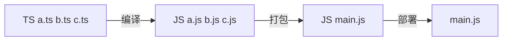

# Typescript

> - [TypeScript: TS Playground - An online editor for exploring TypeScript and JavaScript (typescriptlang.org)](https://www.typescriptlang.org/play?#code/PTAEHUFMBsGMHsC2lQBd5oBYoCoE8AHSAZVgCcBLA1UABWgEM8BzM+AVwDsATAGiwoBnUENANQAd0gAjQRVSQAUCEmYKsTKGYUAbpGF4OY0BoadYKdJMoL+gzAzIoz3UNEiPOofEVKVqAHSKymAAmkYI7NCuqGqcANag8ABmIjQUXrFOKBJMggBcISGgoAC0oACCoASMFmgY7p7ehCTkVOle4jUMdRLYTqCc8LEZzCZmoNJODPHFZZXVtZYYkAAeRJTInDQS8po+rf40gnjbDKv8LqD2jpbYoACqAEoAMsK7sUmxkGSCc+VVQQuaTwVb1UBrDYULY7PagbgUZLJH6QbYmJAECjuMigZEMVDsJzCFLNXxtajBBCcQQ0MwAUVWDEQNUgADVHBQGNJ3KAALygABEAAkYNAMOB4GRogLFFTBPB3AExcwABT0xnM9zsyhc9wASmCKhwDQ8ZC8iElzhB7Bo3zcZmY7AYzEg-Fg0HUiS58D0Ii8AoZTJZggFSRxAvADlQAHJhAA5SASAVBFQAeW+ZF2gldWkgx1QjgUrmkeFATgtOlGWH0KAQiBhwiudokkuiIgMHBx3RYbC43CCJSAA)
> - 包含了ES6和ES5的语法
> - 微软开发
> - 更像面向对象的语法
> - ts>es2016>es2015>es5

## js和ts区别

| ts                                     | js                                   |
| -------------------------------------- | ------------------------------------ |
| js的超集, 用于解决大型项目的代码复杂性 | 脚本语言, 创建动态网页               |
| 编译期间发现并纠正错误                 | 解释型语言, 只有在运行的时候发现错误 |
| 强类型, 支持静态和动态类型             | 弱类型, 没有静态类型选项             |
| 解释成js代码, 使浏览器理解             | 可直接在浏览器运行                   |
| 支持模块, 泛型和接口                   | 不支持模块, 泛型或接口               |

## ts工作流程



## 使用typescript

```shell
npm install -g typescript
tsc helloworld.ts
// helloworld.ts => helloworld.js
tsc --init //创建tsconfig.js文件
```

## 初体验

```ts
// hello.ts
function greet(person: string) {
  return person;
}
console.log(greet('ts'))
```

执行该指令, 编译成`hello.js`

```bash
tsc hello.ts
```

```js
"use strcit"
function greet(persion) {
 return persion;
} 
console.log(greet('ts'))
```

## 基本数据类型

| 数据类型           | 栗子                                                         |
| ------------------ | ------------------------------------------------------------ |
| 布尔值boolean      | `let isDone: boolean = false`                                |
| 数字number         | `let myNumber: number = 6 [十] | 0xf00d [十六] |0b1010 [二]| 0o744 [八]` |
| 字符串string       | let name: string = "hua" ; <br/>let fullName = \`  rui ${name} \` ;  <br/>let sen: string = "guan"+( number + 1) +"hua" |
| 数组(Array)        | let list: number[] = [1, 2, 3]; <br/>let list: Array<number> = [1, 2, 3]; |
| 元组<br>[Tuple]    | let x: [string, number] ;<br/>x= ['hello', 10];<br>x[2] = 2; |
| 枚举</br>[enum]    | enum Color { Red[ =1( 不赋值就会在0开始)], Green, Blue }<br>let c: Color = Color.Green;<br>取值: c[1], c.Red |
| 任意值any          | let notSure : any = 4;//可以避开类型检查器<br>let list: any[] = [1, true, "free" ]<br>//类型的顶级类型 |
| 空值null/void      | function fn() : void{}<br>只能复制null和defined              |
| Null<br/>Unfefined | let u: undefined = undefined;<br>let n: null = null;         |
| Never              | 是任何类型的子类型, 也可以赋值给任何类型, 即使any也不可以给never赋值<br>function error(message: string): never { throw new Error(message);}<br>function fail(): never { return error("Something failed");<br>function infiniteLoop(): never { while(true){}} |
| 类型断言           | let someValue: any = "this is s string";<br>let strLength: number = (someValue as string).length<br>let strLength: number = (<string> someValue>)length |
| Symbol             | const sym = Symbol();<br>let obj = { [sym]: 'ts' }           |
|Unknown|和any类似<br>let value: any;|
|||

### object, Object & {}

#### object

```ts
// node_modules/typescript/lib/lib.es5.d.ts
interface ObjectConstructor {
  create(o: object | null): any;
  // ...
}

const proto = {};

Object.create(proto);     // OK
Object.create(null);      // OK
Object.create(undefined); // Error
Object.create(1337);      // Error
Object.create(true);      // Error
Object.create("oops");    // Error
```

#### Object

Oject接口定义了Object.prototype原型对象

```ts
// node_modules/typescript/lib/lib.es5.d.ts
interface Object {
  constructor: Function;
  toString(): string;
  toLocaleString(): string;
  valueOf(): Object;
  hasOwnProperty(v: PropertyKey): boolean;
  isPrototypeOf(v: Object): boolean;
  propertyIsEnumerable(v: PropertyKey): boolean;
}
```

ObjectConstrucotor接口定义了Object类的属性

```ts
// node_modules/typescript/lib/lib.es5.d.ts
interface Object {
  constructor: Function;
  toString(): string;
  toLocaleString(): string;
  valueOf(): Object;
  hasOwnProperty(v: PropertyKey): boolean;
  isPrototypeOf(v: Object): boolean;
  propertyIsEnumerable(v: PropertyKey): boolean;
}
```

### {}

```ts
// Type {}
const obj = {}

obj.prop = '123';// Error: Property 'prop' does not exist on type '{}'
obj.toString();// "[object object]"
```

## 类型守卫

> 类型保护是课执行运行时检查的一种表达式 用于确保类型在一定的范围内

### in

```ts
interface Admin {
  name: string;
  privileges: string[];
}

interface Employee {
  name: string;
  startDate: Date;
}

type UnknownEmployee = Employee | Admin;

function printEmployeeInformation(emp: UnknownEmployee) {
  console.log("Name: " + emp.name);
  if ("privileges" in emp) {
    console.log("Privileges: " + emp.privileges);
  }
  if ("startDate" in emp) {
    console.log("Start Date: " + emp.startDate);
  }
}
```

### typeof

```ts
function padLeft(value: string, padding: string | number) {
  if (typeof padding === "number") {
      return Array(padding + 1).join(" ") + value;
  }
  if (typeof padding === "string") {
      return padding + value;
  }
  throw new Error(`Expected string or number, got '${padding}'.`);
}
```

### instanceof

```ts
interface Padder {
  getPaddingString(): string;
}

class SpaceRepeatingPadder implements Padder {
  constructor(private numSpaces: number) {}
  getPaddingString() {
    return Array(this.numSpaces + 1).join(" ");
  }
}

class StringPadder implements Padder {
  constructor(private value: string) {}
  getPaddingString() {
    return this.value;
  }
}

let padder: Padder = new SpaceRepeatingPadder(6);

if (padder instanceof SpaceRepeatingPadder) {
  // padder的类型收窄为 'SpaceRepeatingPadder'
}
```

### 自定义保护的类型谓词

```ts
function isNumber(x: any): x is number {
  return typeof x === "number";
}

function isString(x: any): x is string {
  return typeof x === "string";
}
```

## 联合类型和类型别名

#### 联合类型

联合类型通常与 `null` 或 `undefined` 一起使用：

```
const sayHello = (name: string | undefined) => {
  /* ... */
};
```

 `name` 的类型是 `string | undefined` 意味着可以将 `string` 或 `undefined` 的值传递给`sayHello` 函数。

```
sayHello("semlinker");
sayHello(undefined);
```

```
let num: 1 | 2 = 1;
type EventNames = 'click' | 'scroll' | 'mousemove';
```

#### 交叉类型

> 将多个类型合并成一个类型, 通过&运算符

```ts
type PartialPointX = { x: number; };
type Point = PartialPointX & { y: number; };

let point: Point = {
  x: 1,
  y: 1
}

interface X {
  c: string;
  d: string;
}

interface Y {
  c: number;
  e: string
}

type XY = X & Y;
type YX = Y & X;

let p: XY;
let q: YX;
// 这样子c的类型是never
```

## 函数

### 普通函数

```ts
function createUserId(name: string, id: number): string {
  return name + id;
}
```

### 箭头函数

```ts
myBooks.forEach(() => console.log('reading'));

myBooks.forEach(title => console.log(title));

myBooks.forEach((title, idx, arr) =>
  console.log(idx + '-' + title);
);

myBooks.forEach((title, idx, arr) => {
  console.log(idx + '-' + title);
});
```

### 可选参数以及默认参数

```ts
// 可选参数
function createUserId(name: string, id: number, age?: number): string {
  return name + id;
}

// 默认参数
function createUserId(
  name: string = "semlinker",
  id: number,
  age?: number
): string {
  return name + id;
}
```

### 函数重载

```ts
function add(a: number, b: number): number;
function add(a: string, b: string): string;
function add(a: string, b: number): string;
function add(a: number, b: string): string;
function add(a: Combinable, b: Combinable) {
  // type Combinable = string | number;
  if (typeof a === 'string' || typeof b === 'string') {
    return a.toString() + b.toString();
  }
  return a + b;
}
```

## 接口

> 作用: 为这些类型命名和代码或第三方代码定义契约

```typescript
function printLabel( labelledObj: { label: string }) {
  console.log(labelledObj.label)
}
let myObj = { size: 10, label: "Size 10 Object" };
printLabel(myObj);
```

```typescript
interface LavelledValue { label: string } 
function printLabel( lavelledObj: LabelledValue ){
  console.log(lavelledObj.label);
}
let myObj = { size: 10, label: "Size 10 Object"};
printLabel(myObj);
```

```typescript
//?表示可选属性
interface SquareConfig { color?: string; width?: number; }
function createSquare(config: SquareConfig): { color: string; area: numner} {
  let newSquare = { color: "white", area: 100 };
  if(config.color){
    newSquare.color = config.color;
  }
  if(config.width){
    newSquare.width = config.width * config.width;
  }
}
let mySquare = createSquare({ color: "black"})
```

```typescript
//readonly 只读属性[只能在对象创建的时候修改其值]
interface Point { redonly x: number; readonly y: number; }
//ReadonlyArray<T> 数组确保数组创建后不再修改
let a: number[] = [1, 2, 3, 4];
let ro: Readonly Array<numbers> = a;
a = ro as number[];// 断言重写
```

#### Extend

> 接口和类型别名都能够被拓展, 但语法有所不同

**Interface extends interface**

```ts
interface PartialPointX { x: number; }
interface Point extends PartialPointX { 
  y: number; 
}
```

**Type alias extends type alias**

```ts
type PartialPointX = { x: number; };
type Point = PartialPointX & { y: number; };
```

**Interface extends type alias**

```ts
type PartialPointX = { x: number; };
interface Point extends PartialPointX { y: number; }
```

**Type alias extends interface**

```ts
interface PartialPointX { x: number; }
type Point = PartialPointX & { y: number; };
```

implements

> 类可以以相同方式实现**接口**或**类型别名**, 但类不能实现使用类型别名定义的联合类型

```ts
interface Point {
  x: number;
  y: number;
}

class SomePoint implements Point {
  x = 1;
  y = 2;
}

type Point2 = {
  x: number;
  y: number;
};

class SomePoint2 implements Point2 {
  x = 1;
  y = 2;
}

type PartialPoint = { x: number; } | { y: number; };

// A class can only implement an object type or 
// intersection of object types with statically known members.
class SomePartialPoint implements PartialPoint { // Error
  x = 1;
  y = 2;
}
```

## 类

### 属性和方法

```ts
class Greeter {
  // 静态属性
  static cname: string = "Greeter";
  // 成员属性
  greeting: string;

  // 构造函数 - 执行初始化操作
  constructor(message: string) {
    this.greeting = message;
  }

  // 静态方法
  static getClassName() {
    return "Class name is Greeter";
  }

  // 成员方法
  greet() {
    return "Hello, " + this.greeting;
  }
}

let greeter = new Greeter("world");
```

编译成ES5代码

```ts
"use strict";
var Greeter = /** @class */ (function () {
    // 构造函数 - 执行初始化操作
    function Greeter(message) {
      this.greeting = message;
    }
    // 静态方法
    Greeter.getClassName = function () {
      return "Class name is Greeter";
    };
    // 成员方法
    Greeter.prototype.greet = function () {
      return "Hello, " + this.greeting;
    };
    // 静态属性
    Greeter.cname = "Greeter";
    return Greeter;
}());
var greeter = new Greeter("world");
```

### ECMAScript私有字段

> - 私有字段以`#`字符开头
> - 每个私有字段名称都唯一地限定器包含的类
> - 不能在私有字段使用ts可访问修饰符(public 或private等)
> - 私有字段不能在包含的类之外访问, 甚至不能被被检测到

```ts
class Person {
  #name: string;

  constructor(name: string) {
    this.#name = name;
  }

  greet() {
    console.log(`Hello, my name is ${this.#name}!`);
  }
}

let semlinker = new Person("Semlinker");

semlinker.#name;
//     ~~~~~
// Property '#name' is not accessible outside class 'Person'
// because it has a private identifier.
```

### 访问器

> 通过getter和setter方法来实现数据的封装和有效性检验, 防止出现异常数据

```ts
let passcode = "Hello TypeScript";

class Employee {
  private _fullName: string;

  get fullName(): string {
    return this._fullName;
  }

  set fullName(newName: string) {
    if (passcode && passcode == "Hello TypeScript") {
      this._fullName = newName;
    } else {
      console.log("Error: Unauthorized update of employee!");
    }
  }
}

let employee = new Employee();
employee.fullName = "Semlinker";
if (employee.fullName) {
  console.log(employee.fullName);
}
```

### 类的继承

```ts
class Animal {
  name: string;
  
  constructor(theName: string) {
    this.name = theName;
  }
  
  move(distanceInMeters: number = 0) {
    console.log(`${this.name} moved ${distanceInMeters}m.`);
  }
}

class Snake extends Animal {
  constructor(name: string) {
    super(name); // 调用父类的构造函数
  }
  
  move(distanceInMeters = 5) {
    console.log("Slithering...");
    super.move(distanceInMeters);
  }
}

let sam = new Snake("Sammy the Python");
sam.move();
```

### 抽象类

> `abstract`,
>
> 包含一个或多个抽象方法(不包含具体实现的方法)

```ts
abstract class Person {
  constructor(public name: string){}
 // 抽象方法
  abstract say(words: string) :void;
}

// Cannot create an instance of an abstract class.(2511)
const lolo = new Person(); // Error

class Developer extends Person {
  constructor(name: string) {
    super(name);
  }
  
  say(words: string): void {
    console.log(`${this.name} says ${words}`);
  }
}

const lolo = new Developer("lolo");
lolo.say("I love ts!"); // lolo says I love ts!

```

### 类方法重载

> 函数和类的方法都支持重载

```ts
class ProductService {
    getProducts(): void;
    getProducts(id: number): void;
    getProducts(id?: number) {
      if(typeof id === 'number') {
          console.log(`获取id为 ${id} 的产品信息`);
      } else {
          console.log(`获取所有的产品信息`);
      }  
    }
}

const productService = new ProductService();
productService.getProducts(666); // 获取id为 666 的产品信息
productService.getProducts(); // 获取所有的产品信息 
```

## 泛型

> - 用来创建课重用的组件, 一个组件可以支持多种类型的数据, 用户可使用自己的数据类型来使用组件
> - 范类(Generics)是允许一个函数接受不同类型参数的一种模板

```ts
function identity <T, U>(value: T, message: U) : T {
  console.log(message);
  return value;
}

console.log(identity<Number, string>(68, "Semlinker"));
```

### 泛型工具类

#### typeof

> 获取一个变量声明或对象的类型

```ts
interface Person {
  name: string;
  age: number;
}

const sem: Person = { name: 'semlinker', age: 33 };
type Sem= typeof sem; // -> Person

function toArray(x: number): Array<number> {
  return [x];
}

type Func = typeof toArray; // -> (x: number) => number[]
```

#### keyof

> 获取某种类型的所有键, 其返回值是联合类型

```ts
interface Person {
  name: string;
  age: number;
}

type K1 = keyof Person; // "name" | "age"
type K2 = keyof Person[]; // "length" | "toString" | "pop" | "push" | "concat" | "join" 
type K3 = keyof { [x: string]: Person };  // string | number
```

```ts
interface StringArray {
  // 字符串索引 -> keyof StringArray => string | number
  [index: string]: string; 
}
// 使用数字索引时, js在执行索引操作时, 会先把索引转换为字符串先


interface StringArray1 {
  // 数字索引 -> keyof StringArray1 => number
  [index: number]: string;
}
```

#### in

> 遍历枚举类型

```ts
type Keys = "a"|"b"|"c"

type Obj =  {
  [p in Keys]: any
} // -> { a: any, b: any, c: any }
```

#### infer

> 声明一个类型变量, 并且对它进行使用

```ts
type ReturnType<T> = T extends (
  ...args: any[]
) => infer R ? R : any;
// 声明一个变量类继承传入函数签名的返回值类型
// 渠道函数的返回值, 方便之后使用
```

#### extends

```ts
interface Lengthwise {
  length: number;
}

function loggingIdentity<T extends Lengthwise>(arg: T): T {
  console.log(arg.length);
  return arg;
}

loggingIdentity(3);// Error, number doesn't have a .length property
loggingIdentity({length: 10, value: 3});

```

#### partial

> 将某个类型里的属性全部变成为课选项`?`

```ts
/**
 * 定义
 * node_modules/typescript/lib/lib.es5.d.ts
 * Make all properties in T optional
 */
type Partial<T> = {
  [P in keyof T]?: T[P];
};
// 通过keyof T拿到T所有属性名, 然后通过in 进行遍历, 将值赋给P, 最后通过T[P]取得相应的值, ? 使所有属性比那层可选属性

```

## 装饰类

> 实验性功能
>
> - 类装饰器 ( Class decorators)
> - 属性装饰器 ( Property decorators )
> - 方法装饰器 ( Method decorators)
> - 参数装饰器 ( Parameter decorators)

## 编译上下文

#### tsconfig.json 的作用

- 用于标识 TypeScript 项目的根路径；
- 用于配置 TypeScript 编译器；
- 用于指定编译的文件。

#### tsconfig.json 重要字段

- files - 设置要编译的文件的名称；
- include - 设置需要进行编译的文件，支持路径模式匹配；
- exclude - 设置无需进行编译的文件，支持路径模式匹配；
- compilerOptions - 设置与编译流程相关的选项。

#### compilerOptions 选项

compilerOptions 支持很多选项，常见的有 `baseUrl`、 `target`、`baseUrl`、 `moduleResolution` 和 `lib` 等。

compilerOptions 每个选项的详细说明如下：

`tsc --init //创建tsconfig.js文件`

```json
{
  "compilerOptions": {

    /* 基本选项 */
    "target": "es5",                       // 指定 ECMAScript 目标版本: 'ES3' (default), 'ES5', 'ES6'/'ES2015', 'ES2016', 'ES2017', or 'ESNEXT'
    "module": "commonjs",                  // 指定使用模块: 'commonjs', 'amd', 'system', 'umd' or 'es2015'
    "lib": [],                             // 指定要包含在编译中的库文件
    "allowJs": true,                       // 允许编译 javascript 文件
    "checkJs": true,                       // 报告 javascript 文件中的错误
    "jsx": "preserve",                     // 指定 jsx 代码的生成: 'preserve', 'react-native', or 'react'
    "declaration": true,                   // 生成相应的 '.d.ts' 文件
    "sourceMap": true,                     // 生成相应的 '.map' 文件
    "outFile": "./",                       // 将输出文件合并为一个文件
    "outDir": "./",                        // 指定输出目录
    "rootDir": "./",                       // 用来控制输出目录结构 --outDir.
    "removeComments": true,                // 删除编译后的所有的注释
    "noEmit": true,                        // 不生成输出文件
    "importHelpers": true,                 // 从 tslib 导入辅助工具函数
    "isolatedModules": true,               // 将每个文件做为单独的模块 （与 'ts.transpileModule' 类似）.

    /* 严格的类型检查选项 */
    "strict": true,                        // 启用所有严格类型检查选项
    "noImplicitAny": true,                 // 在表达式和声明上有隐含的 any类型时报错
    "strictNullChecks": true,              // 启用严格的 null 检查
    "noImplicitThis": true,                // 当 this 表达式值为 any 类型的时候，生成一个错误
    "alwaysStrict": true,                  // 以严格模式检查每个模块，并在每个文件里加入 'use strict'

    /* 额外的检查 */
    "noUnusedLocals": true,                // 有未使用的变量时，抛出错误
    "noUnusedParameters": true,            // 有未使用的参数时，抛出错误
    "noImplicitReturns": true,             // 并不是所有函数里的代码都有返回值时，抛出错误
    "noFallthroughCasesInSwitch": true,    // 报告 switch 语句的 fallthrough 错误。（即，不允许 switch 的 case 语句贯穿）

    /* 模块解析选项 */
    "moduleResolution": "node",            // 选择模块解析策略： 'node' (Node.js) or 'classic' (TypeScript pre-1.6)
    "baseUrl": "./",                       // 用于解析非相对模块名称的基目录
    "paths": {},                           // 模块名到基于 baseUrl 的路径映射的列表
    "rootDirs": [],                        // 根文件夹列表，其组合内容表示项目运行时的结构内容
    "typeRoots": [],                       // 包含类型声明的文件列表
    "types": [],                           // 需要包含的类型声明文件名列表
    "allowSyntheticDefaultImports": true,  // 允许从没有设置默认导出的模块中默认导入。

    /* Source Map Options */
    "sourceRoot": "./",                    // 指定调试器应该找到 TypeScript 文件而不是源文件的位置
    "mapRoot": "./",                       // 指定调试器应该找到映射文件而不是生成文件的位置
    "inlineSourceMap": true,               // 生成单个 soucemaps 文件，而不是将 sourcemaps 生成不同的文件
    "inlineSources": true,                 // 将代码与 sourcemaps 生成到一个文件中，要求同时设置了 --inlineSourceMap 或 --sourceMap 属性

    /* 其他选项 */
    "experimentalDecorators": true,        // 启用装饰器
    "emitDecoratorMetadata": true          // 为装饰器提供元数据的支持
  }
}
```

开发辅助工具

[json to ts](http://www.jsontots.com/): 指定json 数据生成对应的typescript

[Schemats](https://github.com/SweetIQ/schemats) :基于sql数据库中的schema自动生成typescript接口定义

 [TypeScript AST Viewer](https://ts-ast-viewer.com/) : 在线工具, 查看指定ts代码对应的ast抽象数

[TypeDoc](https://typedoc.org/) : 将 TypeScript 源代码中的注释转换为 HTML 文档或 JSON 模型

[TypeScript ESLint](https://typescript-eslint.io/) : 规范代码质量，提高团队开发效率。
