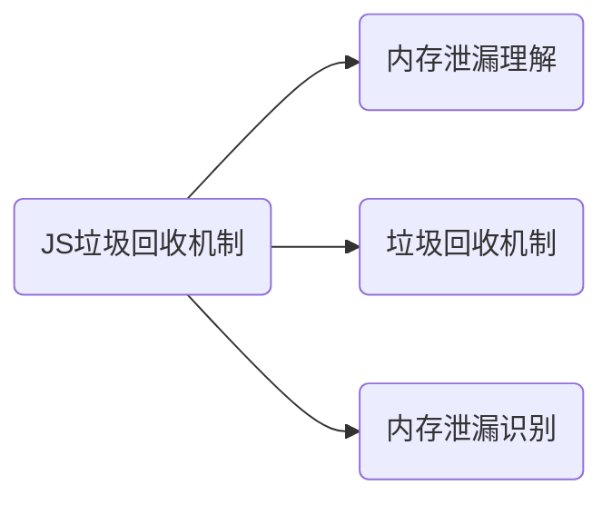

# js垃圾回收机制

## 内存泄漏

> - 程序的运行需要内存，当程序提出要求，操作系统就会供给内存。
> - 对于不再用到的内存，没有及时释放，就叫做内存泄漏。
> - 对于持续运行的服务进程，必须及时释放内存，否则，内存占用越来越高，轻则影响系统性能，重则导致进程崩溃。

## 垃圾回收机制

> JavaScript具有垃圾收集器，垃圾收集器会按照固定的时间间隔周期性的执行。
>
> - 最常见的垃圾回收方式有两种：标记清除, 引用计数

### 标记清除

> 原理：是当变量进入环境时，将这个变量标记为“进入环境”。当变量离开环境时，则将其标记为“离开环境”。标记“离开环境”的就回收内存。

垃圾回收器，在运行的时候会给存储在内存中的所有变量都加上标记。
去掉环境中的变量以及被环境中的变量引用的变量的标记。
再被加上标记的会被视为准备删除的变量。
垃圾回收器完成内存清除工作，销毁那些带标记的值并回收他们所占用的内存空间。

### 引用计数

> 原理：跟踪记录每个值被引用的次数。

声明了一个变量并将一个引用类型的值赋值给这个变量，这个引用类型值的引用次数就是1。
同一个值又被赋值给另一个变量，这个引用类型值的引用次数加1。
当包含这个引用类型值的变量又被赋值成另一个值了，那么这个引用类型值的引用次数减1。
当引用次数变成0时，说明没办法访问这个值了。
当垃圾收集器下一次运行时，它就会释放引用次数是0的值所占的内存。
（注意：当循环引用的时候就会释放不掉内存。）

## 观察内存泄漏

> 如果连续五次垃圾回收之后，内存占用一次比一次大，就有内存泄漏。这就要求实时查看内存占用。

可以浏览器查看内存占用。
通过命令行，命令行可以使用 Node process.memoryUsage提供的方法。process.memoryUsage返回一个对象，包含了 Node 进程的内存占用信息。（判断内存泄漏，以heapUsed字段为准。）
四、总结
内存没有释放或释放及时会造成内存泄漏。

垃圾回收机制的常用方式是标记清除和引用计数。

查看内存泄漏可以通过浏览器和命令行的方式。
