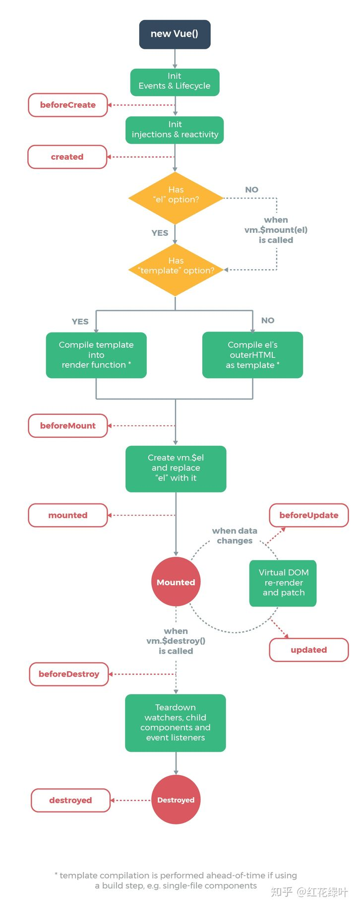

# vue 和 react 异同

## 前言

React 是由 Facebook 创建的JavaScript UI框架，React推广了 Virtual DOM( 虚拟 DOM )并创造了 JSX 语法。JSX 语法的出现允许我们在 javascript 中书写 HTML 代码。

VUE 是由尤雨溪开发的，VUE 使用了模板系统而不是JSX，因其实模板系统都是用的普通的 HTML，所以对应用的升级更方便、更容易，而不需要整体重构。

VUE 相较于 React 更容易上手，如果是一个有一定开发经验的开发者，甚至都不需要花额外的时间去学习，直接一遍开发一遍查文挡即可。

## VUE 与 React 区别

React 的思路是 HTML in JavaScript 也可以说是 All in JavaScript，通过 JavaScript 来生成 HTML，所以设计了 JSX 语法，还有通过 JS 来操作 CSS，社区的styled-component、JSS等。

Vue 是把 HTML，CSS，JavaScript 组合到一起，用各自的处理方式，Vue 有单文件组件，可以把 HTML、CSS、JS 写到一个文件中，HTML 提供了模板引擎来处理。

如下是两者的生命周期对比：

**React 生命周期**

**VUE生命周期**

React 整体是函数式的思想，在 React 中是单向数据流，推崇结合 immutable 来实现数据不可变。而 Vue 的思想是响应式的，也就是基于是数据可变的，通过对每一个属性建立 Watcher 来监听，当属性变化的时候，响应式的更新对应的虚拟 DOM。

如上，所以 React 的性能优化需要手动去做，而Vue的性能优化是自动的，但是Vue的响应式机制也有问题，就是当 state 特别多的时候，Watcher 会很多，会导致卡顿。

## React 与 VUE 共同点

React 与 Vue 存在很多共同点，例如他们都是 JavaScript 的 UI 框架，专注于创造前端的富应用。不同于早期的 JavaScript 框架“功能齐全”，Reat 与 Vue 只有框架的骨架，其他的功能如路由、状态管理等是框架分离的组件。

## 优势

**React**

- 灵活性和响应性：它提供最大的灵活性和响应能力。
- 丰富的JavaScript库：来自世界各地的贡献者正在努力添加更多功能。
- 可扩展性：由于其灵活的结构和可扩展性，React已被证明对大型应用程序更好。
- 不断发展： React得到了Facebook专业开发人员的支持，他们不断寻找改进方法。
- Web或移动平台： React提供React Native平台，可通过相同的React组件模型为iOS和Android开发本机呈现的应用程序。

**Vue**

- 易于使用： Vue.js包含基于HTML的标准模板，可以更轻松地使用和修改现有应用程序。
- 更顺畅的集成：无论是单页应用程序还是复杂的Web界面，Vue.js都可以更平滑地集成更小的部件，而不会对整个系统产生任何影响。
- 更好的性能，更小的尺寸：它占用更少的空间，并且往往比其他框架提供更好的性能。
- 精心编写的文档：通过详细的文档提供简单的学习曲线，无需额外的知识; HTML和JavaScript将完成工作。
- 适应性：整体声音设计和架构使其成为一种流行的JavaScript框架。它提供无障碍的迁移，简单有效的结构和可重用的模板。

## 总结

如上所说的 Vue 的响应式机制也有问题，当 state 特别多的时候，Watcher 会很多，会导致卡顿，所以大型应用（状态特别多的）一般用 React，更加可控。可对于易用性来说，VUE 是更容易上手的，对于项目来说新人更容易接手。

使用 Reac 的公司：Facebook，Instagram，Netflix，纽约时报，雅虎，WhatsApp，Codecademy，Dropbox，Airbnb，Asana，微软等。

使用 Vue 的公司：Facebook，Netflix，Adobe，Grammarly，Behance，小米，阿里巴巴，Codeship，Gitlab和Laracasts等。

所以，技术没有哪个更好或者是更优秀，只要适合自己的才是最合适的。
