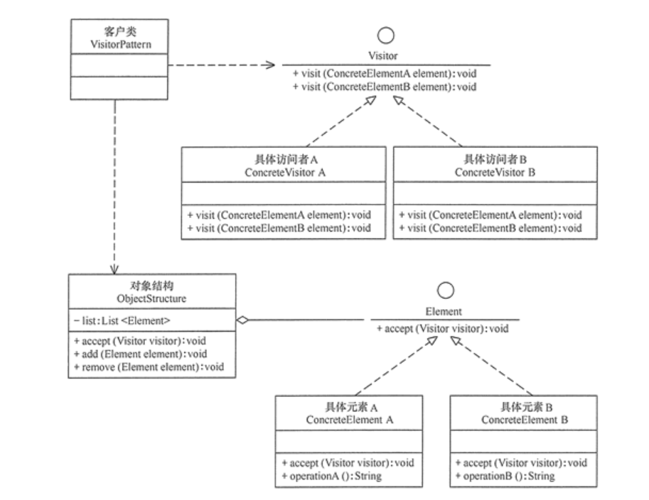

# 访问者模式


> - 访问者模式(Visitor) : 
>   - 提供一个作用于某对象结构中的各元素的操作表示，它使我们可以在不改变各元素的类的前提下定义作用于这些元素的新操作
>
> 优点:
>
> 1. 扩展性好。能够在不修改对象结构中的元素的情况下，为对象结构中的元素添加新的功能。
> 2. 复用性好。可以通过访问者来定义整个对象结构通用的功能，从而提高系统的复用程度。
> 3. 灵活性好。访问者模式将数据结构与作用于结构上的操作解耦，使得操作集合可相对自由地演化而不影响系统的数据结构。
> 4. 符合单一职责原则。访问者模式把相关的行为封装在一起，构成一个访问者，使每一个访问者的功能都比较单一。
>
>
> 缺点:
>
> 1. 增加新的元素类很困难。在访问者模式中，每增加一个新的元素类，都要在每一个具体访问者类中增加相应的具体操作，这违背了“开闭原则”。
> 2. 破坏封装。访问者模式中具体元素对访问者公布细节，这破坏了对象的封装性。
> 3. 违反了依赖倒置原则。访问者模式依赖了具体类，而没有依赖抽象类。




```java
public class VisitorPattern {
    public static void main(String[] args) {
        ObjectStructure os = new ObjectStructure();
        os.add(new ConcreteElementA());
        os.add(new ConcreteElementB());
        Visitor visitor = new ConcreteVisitorA();
        os.accept(visitor);
        System.out.println("------------------------");
        visitor = new ConcreteVisitorB();
        os.accept(visitor);
    }
}

//抽象访问者
interface Visitor {
    void visit(ConcreteElementA element);

    void visit(ConcreteElementB element);
}

//具体访问者A类
class ConcreteVisitorA implements Visitor {
    public void visit(ConcreteElementA element) {
        System.out.println("具体访问者A访问-->" + element.operationA());
    }

    public void visit(ConcreteElementB element) {
        System.out.println("具体访问者A访问-->" + element.operationB());
    }
}

//具体访问者B类
class ConcreteVisitorB implements Visitor {
    public void visit(ConcreteElementA element) {
        System.out.println("具体访问者B访问-->" + element.operationA());
    }

    public void visit(ConcreteElementB element) {
        System.out.println("具体访问者B访问-->" + element.operationB());
    }
}

//抽象元素类
interface Element {
    void accept(Visitor visitor);
}

//具体元素A类
class ConcreteElementA implements Element {
    public void accept(Visitor visitor) {
        visitor.visit(this);
    }

    public String operationA() {
        return "具体元素A的操作。";
    }
}

//具体元素B类
class ConcreteElementB implements Element {
    public void accept(Visitor visitor) {
        visitor.visit(this);
    }

    public String operationB() {
        return "具体元素B的操作。";
    }
}

//对象结构角色
class ObjectStructure {
    private List<Element> list = new ArrayList<Element>();

    public void accept(Visitor visitor) {
        Iterator<Element> i = list.iterator();
        while (i.hasNext()) {
            ((Element) i.next()).accept(visitor);
        }
    }

    public void add(Element element) {
        list.add(element);
    }

    public void remove(Element element) {
        list.remove(element);
    }
}
```


运行结果

```shell
具体访问者A访问-->具体元素A的操作。
具体访问者A访问-->具体元素B的操作。
------------------------
具体访问者B访问-->具体元素A的操作。
具体访问者B访问-->具体元素B的操作。
```


## ts

```typescript
// 简易版 (由于ts不可以重名方法)
class Visitor {
		visitStr(str: string) {
			console.log(str)
		}
		visitNum(num: number) {
			console.log(num)
		}
		visit(obj: any): void {
			// console.log(typeof obj)
			if (typeof obj === 'number') this.visitNum(obj)
			if (typeof obj === 'string') this.visitStr(obj)

		}

	}

	let n: number = 123;
	let s: string = '123str';
	const v = new Visitor();
	v.visit(n)
	v.visit(s)
```

