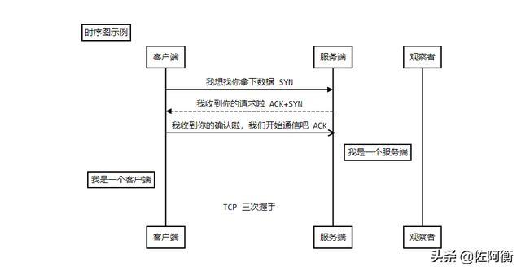

# 时序图

一、 什么是时序图？

时序图（Sequence Diagram），亦称为序列图、循序图或顺序图，是一种UML交互图。它通过描述对象之间发送消息的时间顺序显示多个对象之间的动态协作。

时序图是一个二维图，横轴表示对象，纵轴表示时间，消息在各对象之间横向传递，依照时间顺序纵向排列。

二、 时序图的作用是什么？

1、展示对象之间交互的顺序。将交互行为建模为消息传递，通过描述消息是如何在对象间发送和接收的来动态展示对象之间的交互；

2、相对于其他UML图，时序图更强调交互的时间顺序；

3、可以直观的描述并发进程。

三、 组成元素有哪些？

1. 角色（Actor）

系统角色，可以是人、机器、其他系统、子系统；在时序图中用表示。

2. 对象（Object）

（1）对象的三种命名方式

第一种方式包括对象名和类名，例如：直播课时:课时，在时序图中，用“对象：类”表示；

第二种方式只显示类名，即表示它是一个匿名对象，例如： :课程；在时序图中，用“：类”表示；

第三种方式只显示对象名不显示类名，例如：讲师；在时序图中，用“对象”表示。

（2）命名方式的选择

三种命名方式均可，哪种最容易让阅读该时序图的人理解，就选择哪种。

（3）对象的排列顺序

对象的左右顺序并不重要，但是为了作图清晰整洁，通常应遵循以下两个原则：把交互频繁的对象尽可能的靠拢；2.把初始化整个交互活动的对象放置在最左端。

3. 生命线（Lifeline）

在时序图中表示为从对象图标向下延伸的一条虚线，表示对象存在的时间。

4. 控制焦点（Focus of Control）

又称为激活期，表示时间段的符号，在这个时间段内对象将执行相应的操作。它可以被理解成C语言语义中一对花括号{ }中的内容；用小矩形表示。

5. 消息（Message）

消息一般分为同步消息（Synchronous Message），异步消息（Asynchronous Message）和返回消息（Return Message）。

消息的发送者把控制传递给消息的接收者，然后停止活动，等待消息的接收者放弃或者返回控制。用来表示同步的意义；

消息发送者通过消息把信号传递给消息的接收者，然后继续自己的活动，不等待接受者返回消息或者控制。异步消息的接收者和发送者是并发工作的。

返回消息表示从过程调用返回。

6. 自关联消息

表示方法的自身调用或者一个对象内的一个方法调用另外一个方法。

7. 组合片段

组合片段用来解决交互执行的条件和方式，它允许在序列图中直接表示逻辑组件，用于通过指定条件或子进程的应用区域，为任何生命线的任何部分定义特殊条件和子进程。组合片段共有13种，名称及含义如下：


用来指明在两个或更多的消息序列之间的互斥的选择，相当于经典的if..else..
（1）抉择（Alt）

抉择在任何场合下只发生一个序列。 可以在每个片段中设置一个临界来指示该片段可以运行的条件。else 的临界指示其他任何临界都不为 True 时应运行的片段。如果所有临界都为 False 并且没有 else，则不执行任何片段。


（2）选项（Opt）

包含一个可能发生或不发生的序列；


（3）循环（Loop）

片段重复一定次数，可以在临界中指示片段重复的条件。


（4）并行（Par）


## 标准时序图

> Title:标题 ：指定时序图的标题
> Note direction of 对象:描述 ： 在对象的某一侧添加描述，direction 可以为 right/left/over ， 对象 可以是多个对象，以 , 作为分隔符
> participant 对象 ：创建一个对象
> loop...end ：创建一个循环体
> 对象A->对象B:描述 ： 绘制A与B之间的对话，以实线连接
>
> - -> 实线实心箭头指向
> - --> 虚线实心箭头指向
> - ->> 实线小箭头指向
> - -->> 虚线小箭头指向



```shell
# ```sequence
Title:时序图示例
客户端->服务端: 我想找你拿下数据 SYN
服务端-->客户端: 我收到你的请求啦 ACK+SYN
客户端->>服务端: 我收到你的确认啦，我们开始通信吧 ACK
Note right of 服务端: 我是一个服务端
Note left of 客户端: 我是一个客户端
Note over 服务端,客户端: TCP 三次握手
participant 观察者
```


```shell
# ``` sequence
客户端->打印机: 打印请求(id)
打印机->数据库:请求数据(id)
Note right of 数据库: 执行SQL获取数据
数据库-->打印机:返回数据信息
Note right of 打印机:使用数据打印
打印机-->>客户端:返回打印结果
客户端->客户端:等待提取结果
```

## 带样式时序图

> 需要使用 mermaid 解析，并在开头使用关键字 sequenceDiagram 指明
> 线段的样式遵循 mermaid 的解析方式
>
> - -> ： 实线连接
> - --> ：虚线连接
> - ->> ：实线箭头指向
> - -->> ：虚线箭头指向


```shell
sequenceDiagram
对象A->对象B:中午吃什么？
对象B->>对象A: 随便
loop 思考
对象A->对象A: 努力搜索
end
对象A-->>对象B: 火锅？
对象B->>对象A: 可以
Note left of 对象A: 我是一个对象A
Note right of 对象B: 我是一个对象B
participant 对象C
Note over 对象C: 我自己说了算
```

```shell
# ```mermaid
sequenceDiagram
对象A->对象B:中午吃什么？
对象B->>对象A: 随便
loop 思考
对象A->对象A: 努力搜索
end
对象A-->>对象B: 火锅？
对象B->>对象A: 可以
Note left of 对象A: 我是一个对象A
Note right of 对象B: 我是一个对象B
participant 对象C
Note over 对象C: 我自己说了算
```
