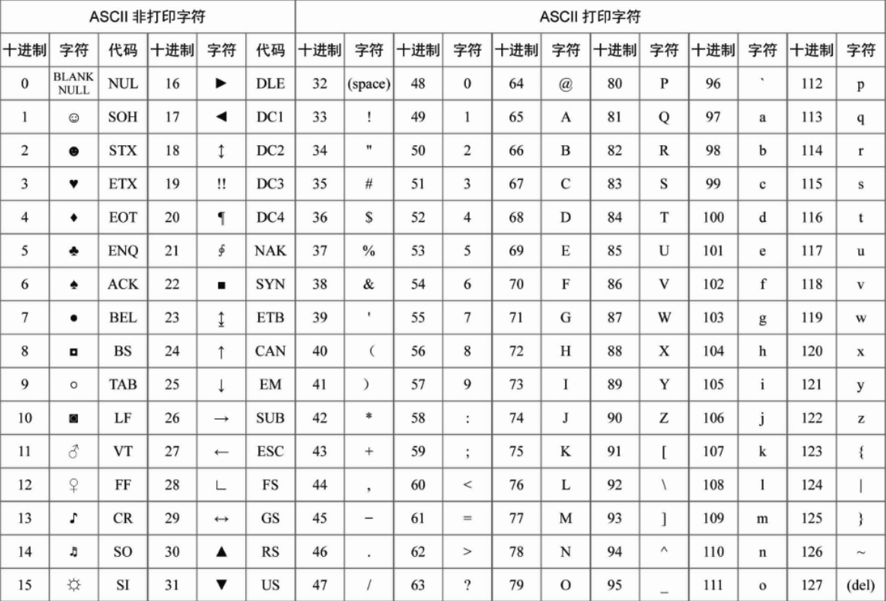

---
53
---
# Python

## print()函数输出

> `print(输出的内容)`

## ASCII 码

> `chr(56)` => 8
> `print ("\u4e2d\u56fd\")` => 中国



## 保留字和标识符


## 类型转换函数

| 函数                   | 描述                                               |
| :--------------------- | :------------------------------------------------- |
| int(x)                 | 将 x 转换为整数类型                                |
| float(x)               | 将 x 转换为浮点数类型                              |
| complex(real [, imag]) | 创建一个复数                                       |
| str(x)                 | 将 x 转换为字符串                                  |
| repr(x)                | 将 x 转换为表达式字符串                            |
| eval(str)              | 计算在字符串中的有效 Python 表达式，并返回一个对象 |
| chr(x)                 | 将整数 x 转换为一个字符                            |
| ord(x)                 | 将一个字符 x 转换为它所对应的整数值                |
| hex(x)                 | 将一个整数 x 转换为一个十六进制字符串              |
| oct(x)                 | 将一个整数 x 转换为一个八进制的字符串              |

## 流程控制

> 跳转语句 `break` 和 `continue`

### if & else & elif

```txt
if 表达式:
  # 语句块1
else 
  # 语句块2
```

```txt
if 表达式:
  # 语句块1
elif
  # 语句块2
else 
  # 语句块3
```

#### 简写

##### Exmple

简写前

```py
a = -9
if a > 0:
 b = a
else: 
 b = -a
print(b)
```

简写

```py
a = -9
b = a if a>0 else -a
print(b)
```

### while

```py
while 条件表达式: 
 循环体
```

### for

```py
for 迭代变量 in 对象: 
 循环体
```
