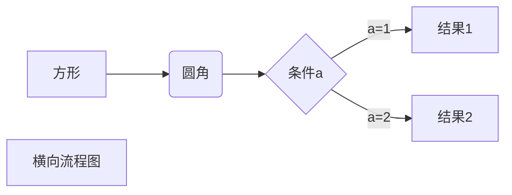
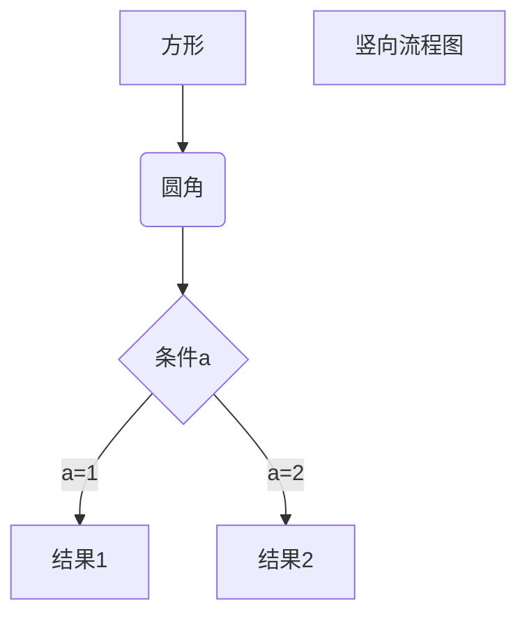
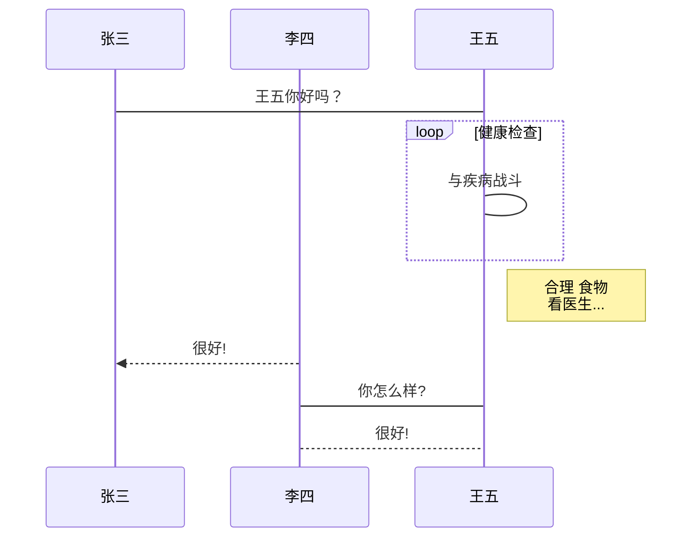

# Markdown

## 图

### 流程图

#### 横向流程图

#### 竖向流程图

### 时序图

#### 标准时序图

## 数学表达式

- 需要在TeX或LaTeX格式的数学公式前后添加$$来实现

- 可以使用数学公式块 "$$" + 回车
  - 快捷键: Ctrl + Shift +  m
  - 点击 "段落" + " 公式块"

- `$2^{2}$` : $2^{2}$

$$ y(x) = \begin{cases} \sqrt\frac{1}{x},x = 0\\ \sqrt\frac{2}{x}, x\neq0 \end{cases} $$

| 上/下标  | x^2, y_2                              | $x^2,y_2$                                 |
| -------- | ------------------------------------- | ----------------------------------------- |
| 分式     | 1/2, \frac{1}{2}                      | $1/2$, $ \frac{1}{2}$                     |
| 省略号   | \cdots                                | $\cdots$                                  |
| 开根号   | \sqrt{2}                              | $\sqrt{2}$                                |
| 矢量     | \vec{a}                               | $\vec{a}$                                 |
| 积分     | \int{x}dx, \int_{1}^{2}{x}dx          | $\int{x}dx$,$\int_{1}^{2}{x}dx$           |
| 极限     | \lim{a+b}, \lim_{n\rightarrow+\infty} | $\lim{a+b}$, $\lim_{n\rightarrow+\infty}$ |
| 累加     | \sum{a}, \sum_{n=1}^{100}{a_n}        | $\sum{a}$, $\sum_{n=1}^{100}{a_n}$        |
| 累乘     | \prod{x},\prod_{n=1}^{n=99}{x_n}      | $\prod{x}$, $\prod_{n=1}^{99}{x_n}$       |
| 三角函数 | \sin                                  | $\sin$                                    |
| 对数函数 | \ln2, \log_2^8, \lg10                 | $\ln2$, $\log_2^8$,$\lg10$                |

### 关系运算符

| 运算符   | Markdown |
| -------- | -------- |
| $\pm$    | \pm      |
| $\times$ | \times   |
| $\cdot$  | \cdot    |
| $\div$   | \div     |
| $\neq$   | \neq     |
| $\leq$   | \leq     |
| $\geq$   | \geq     |
|          |          |

### 其他特殊字符

| 符号         | Markdown   |
| ------------ | ---------- |
| $\forall$    | \forall    |
| $\infty$     | \infty     |
| $\emptyset$  | \emptyset  |
| $\exists$    | \exists    |
| $\nabla$     | \nabla     |
| $\bot$       | \bot       |
| $\angle$     | \angle     |
| $\because$   | \because   |
| $\therefore$ | \therefore |
| 空格         | \quad      |
|              |            |

### 希腊字母

| 大写     | Markdown | 小写          | Markdown    |
| -------- | -------- | ------------- | ----------- |
| $A$      | A        | $\alpha$      | \alpha      |
| $B$      | B        | $\beta$       | \beta       |
| $\Gamma$ | \Gamma   | $\gamma$      | \gamma      |
| $\Delta$ | \Delta   | $\delta$      | \delta      |
| $E$      | E        | $\epsilon$    | \epsilon    |
|          |          | $\varepsilon$ | \varepsilon |
| $Z$      | Z        | $\zeta$       | \zeta       |
| $H$        | H        | $\eta$     | \eta     |
| $\Theta$   | \Theta   | $\theta$   | \theta   |
| $I$      | I        | $\iota$    | \iota    |
| $K$      | K        | $\kappa$   | \kappa   |
| $\Lambda$  | \Lambda  | $\lambda$  | \lambda  |
| $M$      | M        | $\mu$      | \mu      |
| $N$      | N        | $\nu$      | \nu      |
| $\Xi$      | \Xi      | $\xi$     | \xi      |
| $O$      | O        | $\omicron$ | \omicron |
| $\Pi$      | \Pi      | $\pi$      | \pi      |
| $P$      | P        | $\rho$     | \rho     |
| $\Sigma$   | \Sigma   | $\sigma$   | \sigma   |
| $T$      | T        | $\tau$     | \tau     |
| $\Upsilon$ | \Upsilon | $\upsilon$ | \upsilon |
| $\Phi$     | \Phi     | $\phi$     | \phi     |
|            |          | $\varphi$  | \varphi  |
| $X$      | X        | $\chi$     | \chi     |
| $\Psi$     | \Psi     | $\psi$     | \psi     |
| $\Omega$   | \Omega   | $\omega$   | \omega   |
